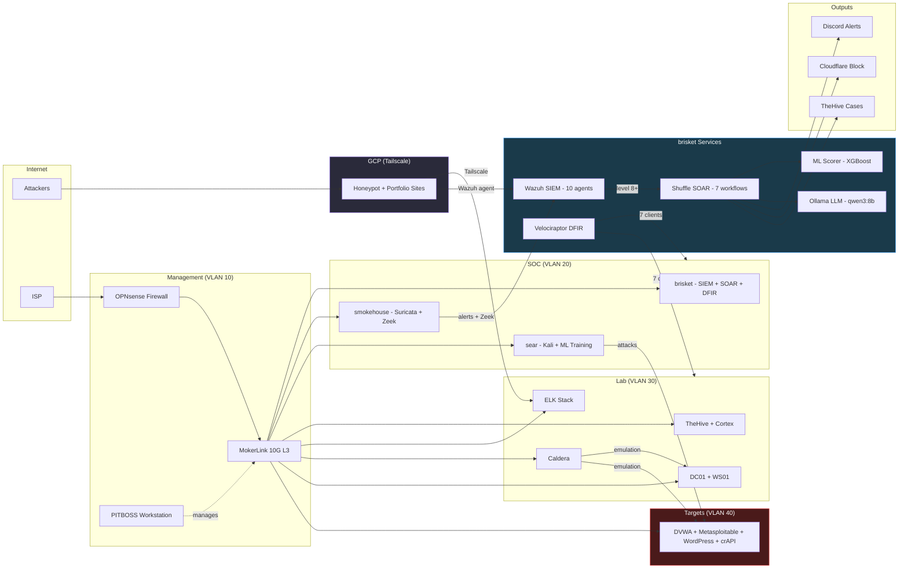
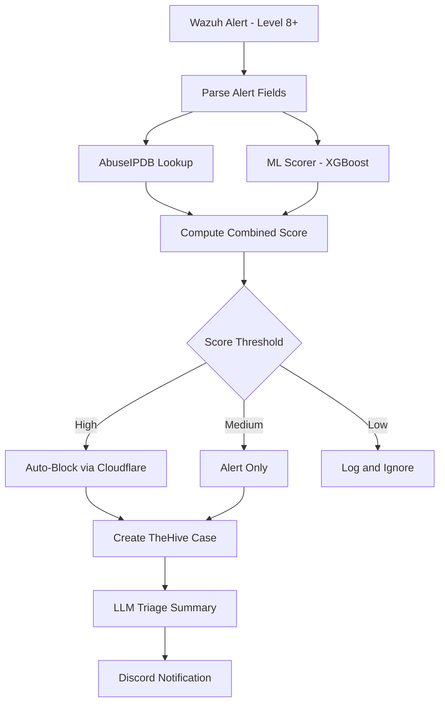

# HomeLab SOC

> Enterprise-grade Security Operations Center built on commodity hardware -- SIEM, SOAR, DFIR, ML threat detection, and LLM-augmented automation.

           

---

## Architecture



---

## Key Metrics

| Metric | Value |
|--------|-------|
| Wazuh agents | **10** across 5 VLANs + GCP cloud |
| SOAR workflows | **7** with LLM augmentation (Ollama qwen3:8b) |
| Elastic detection rules | **~1,419** total (214 actively enabled) |
| ML threat scorer | **PR-AUC 0.9998** (XGBoost binary classifier) |
| Velociraptor DFIR clients | **7** endpoints |
| Docker containers (brisket) | **12** services |
| MITRE ATT&CK adversary profiles | **29** (Caldera) |
| Cortex analyzers | **5** (AbuseIPDB, VirusTotal, Shodan, Abuse Finder, GoogleDNS) |
| Migration duration | **4 days** (estimated 4-6 weeks) |

---

## Migration Phases

All 11 phases completed February 10-13, 2026. Full engineering narrative with key decisions, challenges, and outcomes in [docs/phases.md](docs/phases.md).

| Phase | Name | Summary |
|:-----:|------|---------|
| :white_check_mark: 1 | **brisket Online** | Ubuntu 24.04, Docker, NVIDIA RTX A1000, Ollama, Prometheus + Grafana |
| :white_check_mark: 2 | **Wazuh SIEM** | 10 agents, Zeek pipeline (7 indices), MokerLink ACL micro-segmentation |
| :white_check_mark: 3 | **Hard Cutover** | smokehouse converted to sensor-only, 38 GB backed up |
| :white_check_mark: 4 | **Case Management** | TheHive 4 + Cortex 3 on Proxmox LXC, 5 analyzers |
| :white_check_mark: 5 | **Shuffle SOAR** | WF1 (enrichment + auto-block), WF2 (watch digest) |
| :white_check_mark: 6 | **Velociraptor DFIR** | 7 clients enrolled across all platforms |
| :white_check_mark: 7 | **Caldera Adversary Emulation** | 4 Sandcat agents, Wazuh detection validated |
| :white_check_mark: 8 | **ML Pipeline v3** | 6 models + hybrid, XGBoost PR-AUC 0.9998, deployed to ml-scorer |
| :white_check_mark: 9 | **Ollama LLM Integration** | 7 workflows using qwen3:8b for triage and analysis |
| :white_check_mark: 10 | **ELK Stack (Dual-SIEM)** | Elasticsearch 8.17, 214 detection rules, 4 Fleet agents |
| :white_check_mark: 11 | **Proxmox Backup Server** | NFS to smokehouse 17 TB, daily + weekly backup jobs |

---

## Table of Contents

- [Architecture](#architecture)
- [Key Metrics](#key-metrics)
- [Migration Phases](#migration-phases)
- [Network Topology](#network-topology)
- [SOAR Workflows](#soar-workflows)
- [ML Pipeline](#ml-pipeline)
- [Honeypot Research](#honeypot-research)
- [Getting Started](#getting-started)
- [Lessons Learned](#lessons-learned)

**Component Documentation:**

| Folder | Description |
|--------|-------------|
| [`docs/`](docs/) | Architecture, network topology, migration phases |
| [`wazuh/`](wazuh/) | SIEM -- rules, decoders, agent configs |
| [`elastic/`](elastic/) | ELK Stack -- detection rules, dashboards, Fleet policies |
| [`shuffle/`](shuffle/) | SOAR -- workflow JSON exports, trigger scripts |
| [`ml-pipeline/`](ml-pipeline/) | ML threat detection -- model card, architecture |
| [`honeypot/`](honeypot/) | Honeypot research -- sync scripts, dashboards |
| [`incident-response/`](incident-response/) | Velociraptor DFIR -- deployment configs |
| [`adversary-simulation/`](adversary-simulation/) | Caldera -- adversary profiles, attack scripts |
| [`infrastructure/`](infrastructure/) | Docker Compose files, deployment configs |
| [`scripts/`](scripts/) | Operational automation scripts |

---

## Network Topology

Five VLANs routed through OPNsense with strict inter-VLAN firewall rules and switch-level ACL micro-segmentation.

| VLAN | Subnet | Purpose |
|------|--------|---------|
| 10 | 10.10.10.0/24 | Management -- firewall, switch, workstation |
| 20 | 10.10.20.0/24 | SOC infrastructure -- SIEM, sensors, attack box |
| 30 | 10.10.30.0/24 | Lab -- Proxmox, AD domain, incident response |
| 40 | 10.10.40.0/24 | Targets -- **fully isolated**, attack surfaces only |
| 50 | 10.10.50.0/24 | IoT -- internet-only, no lateral movement |

Full topology, firewall rules, and switch ACL details in [docs/network-topology.md](docs/network-topology.md).

<details>
<summary><strong>Hardware Inventory</strong></summary>

| Host | Hardware | Role |
|------|----------|------|
| **brisket** | Lenovo ThinkStation P3 Tiny (Ultra 9 285, 64 GB, RTX A1000) | v3 SOC platform -- SIEM, SOAR, DFIR, ML, LLM |
| **smokehouse** | QNAP TVS-871 (i7-4790S, 16 GB, 32 TB RAID) | Network sensor (Suricata + Zeek), backup target |
| **sear** | ASUS ROG Strix G512LI (i5-10300H, 32 GB, GTX 1650 Ti) | Kali attack box, ML model training |
| **pitcrew** | Lenovo ThinkStation P340 Tiny (i7-10700T, 32 GB) | Proxmox VE -- AD lab, TheHive, ELK Stack |
| **smoker** | Lenovo ThinkStation P340 Tiny (i7-10700T, 32 GB) | Proxmox VE -- Caldera, attack targets, PBS |
| **PITBOSS** | ASUS TUF Dash F15 (i7-12650H, 64 GB) | Management workstation (Windows 11) |
| **OPNsense** | Protectli VP2420 (J6412, 8 GB) | Firewall / router -- inter-VLAN routing, NAT |
| **MokerLink** | 10G08410GSM (8x 10GbE + 4x SFP+) | L3 managed switch -- SPAN port mirroring, ACL |
| **GCP VM** | Google Cloud e2-medium (2 vCPU, 4 GB) | External honeypot, portfolio hosting, Wazuh agent |

Total cluster: **176 GB RAM**, **12 GB GPU VRAM** (RTX A1000 + GTX 1650 Ti).

</details>

---

## SOAR Workflows

Seven Shuffle SOAR workflows automate enrichment, triage, response, and intelligence reporting. Five use Ollama (qwen3:8b) for natural language analysis. All credentials are centralized as workflow variables -- no hardcoded secrets in exported JSON.

| ID | Workflow | Trigger | Description |
|----|----------|---------|-------------|
| WF1 | **Threat Enrichment and Auto-Block** | Wazuh webhook (level 8+) | AbuseIPDB + ML scorer + Ollama triage -- TheHive case + Discord alert |
| WF2 | **Watch Turnover Digest** | Cron (06:05 / 18:05 EST) | Navy-style shift handoff digest with LLM narrative |
| WF3 | **Detection Gap Analyzer** | Webhook (on demand) | Caldera campaign coverage vs. Wazuh detections -- MITRE ATT&CK gap report |
| WF5 | **Daily Alert Cluster Triage** | Cron (06:00 EST) | Cluster + LLM classify (CAMPAIGN / ROUTINE / INVESTIGATE) -- TheHive alerts |
| WF6 | **Model Drift Detector** | Cron (09:00 EST) | Feature distribution monitoring -- alerts on score drift |
| WF7 | **Honeypot Intel Report** | Cron (Sun 12:00 EST) | Weekly honeypot analysis with LLM intelligence summary |
| WF8 | **LLM Log Anomaly Finder** | Cron (15:00 EST) | Rare alert pattern classification -- catches rule-blind anomalies |

Full workflow documentation and JSON exports in [`shuffle/`](shuffle/).

### WF1 Flow: Threat Enrichment and Auto-Block



---

## ML Pipeline

Custom ML threat detection pipeline trained on labeled attack traffic from Caldera campaigns and the `run_attack.sh` framework. The XGBoost binary classifier achieves **PR-AUC 0.9998** on temporal test splits.

**Architecture:**
- **Training data:** 1.28M records from Wazuh alerts + Zeek conn.log, enriched with Caldera ground-truth labels
- **Features:** 31 behavioral features (temporal, Zeek connection, alert context) -- no IP-based features to avoid network-specific bias
- **Models trained:** XGBoost, LightGBM, RandomForest, LogisticRegression, IsolationForest, SelfTrainingClassifier
- **Hybrid scoring:** `(1-w) * xgboost_prob + w * isolation_forest_score` for zero-day coverage
- **Deployment:** FastAPI container on brisket (port 5002), GPU-accelerated inference on RTX A1000
- **Integration:** Shuffle WF1 (real-time scoring), WF6 (daily drift monitoring)

Model card with evaluation metrics, intended use, and limitations: [`ml-pipeline/model-cards/xgboost-threat-scorer.md`](ml-pipeline/model-cards/xgboost-threat-scorer.md)

Full training source code and notebooks: [soc-ml repository](https://github.com/brianchaplow/soc-ml)

---

## Honeypot Research

A WordPress login honeypot on a GCP VM captures real-world credential stuffing attempts for academic research (INST 570). Logs ship to the ELK Stack via Fluent Bit over a Tailscale overlay network.

| Index | Source | Records | Description |
|-------|--------|---------|-------------|
| `honeypot-credentials` | Fluent Bit | ~3,140 | Username/password pairs captured by PHP honeypot |
| `honeypot-access` | Fluent Bit | ~737 | Apache access logs for the honeypot vhost |
| `honeypot-wazuh` | Cron sync | ~5,925 | Wazuh alerts for GCP VM agent 009 |

A 15-panel **Kibana dashboard** visualizes credential capture volume, top usernames/passwords, source IP geolocation, MITRE ATT&CK technique mapping, and HTTP user-agent analysis.

Shuffle WF7 produces a weekly LLM-authored intelligence summary delivered to Discord.

Full documentation, sync scripts, and dashboard builder: [`honeypot/`](honeypot/)

---

## Getting Started

### Hardware Requirements

The SOC platform (brisket) needs at least 32 GB RAM and an NVIDIA GPU for ML/LLM inference. The Proxmox hosts need 32 GB each. See [docs/architecture.md](docs/architecture.md) for the full inventory.

### Quick Start

```bash
# Clone the repository
git clone https://github.com/brianchaplow/homelab-soc-portfolio.git
cd homelab-soc-portfolio

# Copy the environment template
cp .env.example .env
# Edit .env with your credentials (API keys, passwords, service URLs)

# See docs/ for deployment guides
```

Component deployment is documented in each folder's README. Start with [docs/architecture.md](docs/architecture.md) for the full picture, then follow the [migration phases](docs/phases.md) for the build sequence.

---

## Lessons Learned

The 4-day migration produced hard-won operational knowledge. These are not textbook lessons -- they come from deploying, breaking, and fixing these tools in production.

- **Resource planning on thin clients:** JVM stacking on 32 GB Proxmox hosts requires careful memory budgeting. TheHive, Cortex, Cassandra, and Elasticsearch each consume 1.3-1.5x their configured heap in resident memory. Every RAM allocation decision cascades. ([Phase 4](docs/phases.md#phase-4-case-management), [Phase 10](docs/phases.md#phase-10-elk-stack-dual-siem))

- **Shuffle on-prem scheduler is interval-based, not cron:** The `frequency` field must be an integer (seconds); cron expressions in the UI are cosmetic on-prem. System cron triggering workflows via curl is the correct architecture for hitting exact times. ([Phase 5](docs/phases.md#phase-5-shuffle-soar))

- **Windows agent deployment patterns:** Each agent (Wazuh, Velociraptor, Elastic, Caldera) needs its own firewall exception. Tamper Protection must be disabled in a specific order. Caldera persistence mechanisms accumulate across campaigns until VMs become unrecoverable -- always snapshot first. ([Phase 7](docs/phases.md#phase-7-caldera-adversary-emulation))

- **Dual-SIEM provides direct comparison experience:** Running Wazuh and Elastic simultaneously exposes real architectural differences -- integrated opinionated platform vs. flexible query-driven framework. The tradeoff conversation becomes informed by lived experience, not textbook knowledge. ([Phase 10](docs/phases.md#phase-10-elk-stack-dual-siem))

- **Detailed planning compresses execution:** The original 4-6 week estimate was compressed to 4 days because every technology was researched in advance with clear success criteria. The 1,700-line planning document took longer to write than the migration took to execute. ([Phase 11](docs/phases.md#final-state-summary))

---

## License

[MIT License](LICENSE)

## Author

**Brian Chaplow** -- [github.com/brianchaplow](https://github.com/brianchaplow)
