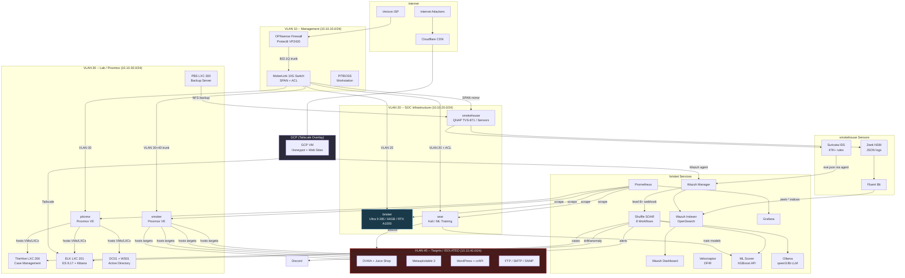
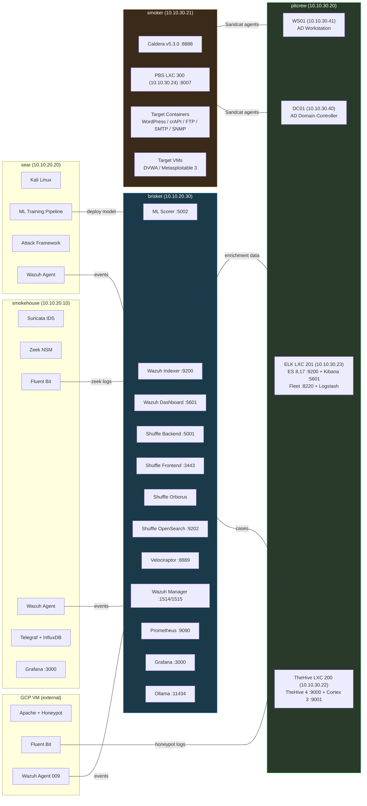
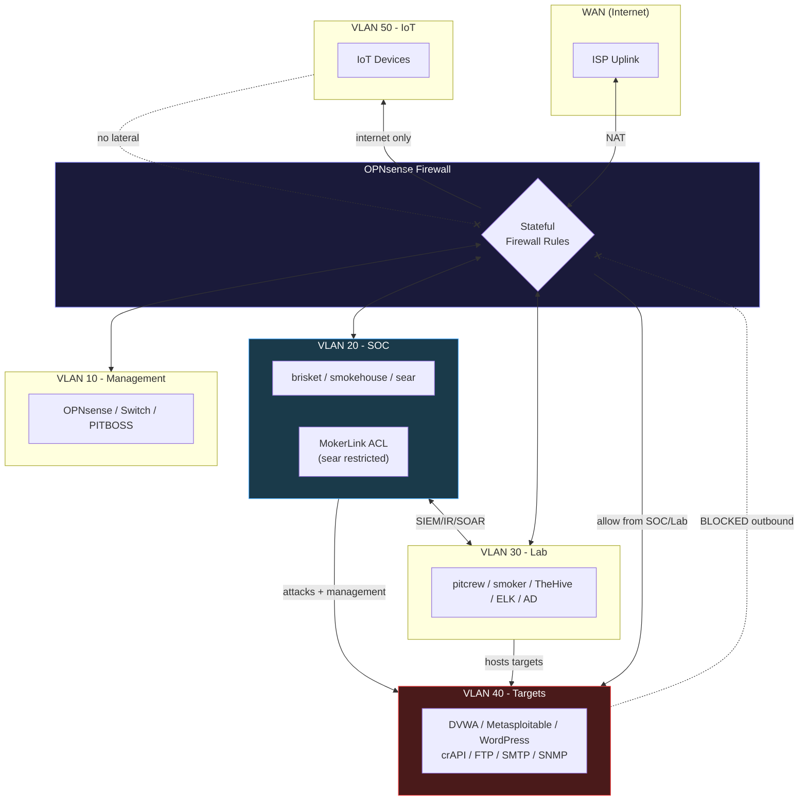

# Architecture

**Author:** Brian Chaplow
**Last Updated:** 2026-02-19

Full technical architecture of the HomeLab SOC v3 platform -- hardware, network, services, data flows, and security design. All 11 migration phases completed in 4 days (Feb 10-13, 2026).

---

## Table of Contents

- [Hardware Inventory](#hardware-inventory)
- [Network Architecture](#network-architecture)
- [Service Architecture](#service-architecture)
- [Data Flow](#data-flow)
- [Security Architecture](#security-architecture)
- [Architecture Diagrams](#architecture-diagrams)

---

## Hardware Inventory

The lab uses BBQ-themed naming -- a nod to the intersection of low-and-slow cooking and security operations (patience is a virtue in both).

| Host | Hardware | CPU | RAM | Storage | Role |
|------|----------|-----|-----|---------|------|
| **brisket** | Lenovo ThinkStation P3 Tiny Gen 2 | Intel Ultra 9 285 (24C/24T) | 64 GB DDR5 | 1 TB + 2 TB NVMe | v3 SOC platform -- SIEM, SOAR, DFIR, ML, LLM |
| **smokehouse** | QNAP TVS-871 NAS | Intel i7-4790S (4C/8T) | 16 GB DDR3 | 32 TB (8x4TB RAID) | Network sensor (Suricata + Zeek), metrics, backup target |
| **sear** | ASUS ROG Strix G512LI | Intel i5-10300H (4C/8T) | 32 GB DDR4 | 512 GB NVMe | Kali attack box, ML model training (GTX 1650 Ti) |
| **pitcrew** | Lenovo ThinkStation P340 Tiny | Intel i7-10700T (8C/16T) | 32 GB DDR4 | 512 GB NVMe | Proxmox VE -- AD lab, TheHive, ELK Stack |
| **smoker** | Lenovo ThinkStation P340 Tiny | Intel i7-10700T (8C/16T) | 32 GB DDR4 | 512 GB NVMe | Proxmox VE -- Caldera, attack targets, PBS |
| **PITBOSS** | ASUS TUF Dash F15 | Intel i7-12650H (10C/16T) | 64 GB DDR5 | 2 TB NVMe | Primary workstation (Windows 11) |
| **OPNsense** | Protectli VP2420 | Intel J6412 (4C/4T) | 8 GB DDR4 | 128 GB eMMC | Firewall / router -- inter-VLAN routing, NAT |
| **MokerLink** | 10G08410GSM | -- | -- | -- | L3 managed switch (8x 10GbE + 4x SFP+), SPAN, ACL |
| **GCP VM** | Google Cloud e2-medium | 2 vCPU | 4 GB | 50 GB | External honeypot, portfolio hosting, Wazuh agent |

**GPU acceleration:**
- **brisket** -- NVIDIA RTX A1000 (8 GB GDDR6) for ML inference (ml-scorer) and LLM inference (Ollama qwen3:8b)
- **sear** -- NVIDIA GTX 1650 Ti (4 GB GDDR6) for ML model training (XGBoost, LightGBM, IsolationForest)

---

---

## Network Architecture

### VLAN Design

Five VLANs provide logical segmentation, all routed through OPNsense with strict inter-VLAN firewall rules.

| VLAN | Subnet | Gateway | Purpose |
|------|--------|---------|---------|
| 10 | 10.10.10.0/24 | 10.10.10.1 | Management -- firewall, switch, workstation |
| 20 | 10.10.20.0/24 | 10.10.20.1 | SOC infrastructure -- SIEM, sensors, attack box |
| 30 | 10.10.30.0/24 | 10.10.30.1 | Lab -- Proxmox hosts, AD domain, incident response |
| 40 | 10.10.40.0/24 | 10.10.40.1 | Targets -- **fully isolated**, attack surfaces only |
| 50 | 10.10.50.0/24 | 10.10.50.1 | IoT -- internet-only, no lateral movement |

An additional family network (192.168.100.0/24 DMZ + 192.168.50.0/24 LAN) is segregated via the OPNsense `igc3` interface to an ASUS consumer router, completely isolated from the lab VLANs.

### Physical Topology

OPNsense connects to the MokerLink switch via an 802.1Q trunk carrying all five VLANs. The switch handles L2 forwarding and SPAN port mirroring, while OPNsense handles all inter-VLAN routing and firewall policy.

| Switch Port | Host | VLAN(s) | Notes |
|-------------|------|---------|-------|
| TE2 | pitcrew | 30 | Proxmox host (AD lab, TheHive, ELK) |
| TE3 | smoker | 30 + 40 (trunk) | Proxmox host (Caldera, target VMs, Docker targets) |
| TE4 | sear | 20 | Attack box (ACL-restricted, see below) |
| TE7 | brisket | 20 | SOC platform |
| TE9 | smokehouse | 20 | Primary NIC (sensor data + management) |
| TE10 | smokehouse | mirror | SPAN capture (all ports mirrored, no IP assigned) |

### OPNsense Interface Map

| NIC | OPNsense Name | VLAN | IP | Purpose |
|-----|---------------|------|----|---------|
| igc0 | (trunk parent) | all | -- | 802.1Q trunk to MokerLink |
| igc0_vlan10 | LAN | 10 | 10.10.10.1/24 | Management gateway |
| vlan01 | SOC | 20 | 10.10.20.1/24 | SOC infrastructure gateway |
| vlan02 | Lab | 30 | 10.10.30.1/24 | Lab / Proxmox gateway |
| vlan03 | Targets | 40 | 10.10.40.1/24 | Isolated targets gateway |
| vlan04 | IoT | 50 | 10.10.50.1/24 | IoT gateway |
| igc1 | WAN | -- | DHCP | ISP uplink |
| igc3 | AsusRouter | -- | 192.168.100.1/24 | Family network handoff |

### Inter-VLAN Firewall Rules

| Source | Destination | Action | Purpose |
|--------|-------------|--------|---------|
| VLAN 20 (SOC) | VLAN 40 (Targets) | ALLOW | sear attacks target hosts |
| VLAN 30 (Lab) | VLAN 40 (Targets) | ALLOW | smoker hosts target containers via ipvlan |
| VLAN 40 (Targets) | Any | DENY (except established) | Targets cannot initiate outbound connections |
| VLAN 50 (IoT) | Internet only | ALLOW | IoT has no lateral movement capability |
| VLAN 20 (SOC) | VLAN 30 (Lab) | ALLOW | brisket manages TheHive, ELK, Caldera |
| All VLANs | VLAN 10 (Mgmt) | Restricted | Only management protocols allowed |

### MokerLink ACL Micro-Segmentation

Intra-VLAN traffic between sear and brisket (both on VLAN 20) is L2-switched and never reaches OPNsense. The MokerLink L3 switch enforces a stateless ACL on sear's physical port (TE4) to restrict which services the attack box can reach on the SOC platform.

**Permitted flows (sear to brisket):**
- TCP 1514 -- Wazuh agent registration
- TCP 1515 -- Wazuh agent enrollment
- TCP 9200 -- OpenSearch (ML pipeline data queries)

**Permitted flows (brisket to sear):**
- TCP 9100 -- Prometheus node_exporter scrape
- TCP 22 -- SSH management

**Everything else between sear and brisket is denied.** This prevents the attack box from reaching Shuffle, Grafana, Velociraptor, or other sensitive management interfaces, even though they share the same subnet.

> Because switch ACLs are stateless, each brisket-initiated connection to sear requires an explicit return-traffic rule matching on source port. Without it, the SYN-ACK from sear hits the deny-all before reaching the catch-all permit.

---

## Service Architecture

### brisket (10.10.20.30) -- v3 SOC Platform

The primary SOC server runs 12 Docker containers plus Ollama as a host service. Ubuntu 24.04 LTS.

| Service | Container | Port(s) | Purpose |
|---------|-----------|---------|---------|
| Wazuh Manager | wazuh.manager | 1514, 1515, 514/UDP, 55000 | SIEM -- 10 agents + OPNsense syslog |
| Wazuh Indexer | wazuh.indexer | 9200 | OpenSearch backend (wazuh-alerts + zeek indices) |
| Wazuh Dashboard | wazuh.dashboard | 5601 | SIEM web interface |
| Shuffle Frontend | shuffle-frontend | 3443 | SOAR web interface |
| Shuffle Backend | shuffle-backend | 5001 | SOAR API + workflow engine (8 workflows) |
| Shuffle Orborus | shuffle-orborus | -- | Worker container orchestrator |
| Shuffle OpenSearch | shuffle-opensearch | 9202 | SOAR internal state store |
| Velociraptor | velociraptor | 8889, 8000, 8001 | DFIR server (7 enrolled clients) |
| ML Scorer | ml-scorer | 5002 | XGBoost threat scoring API (FastAPI + GPU) |
| Prometheus | prometheus | 9090 | Metrics collection (6 scrape targets) |
| Grafana | grafana | 3000 | SOC v3 Overview dashboard |
| Ollama (host) | -- (systemd) | 11434 | LLM inference (qwen3:8b, 8B params) |

**SOAR Workflows (Shuffle):**

| Workflow | Trigger | Function |
|----------|---------|----------|
| WF1 | Webhook (Wazuh level 8+) | Threat enrichment (AbuseIPDB + ML + LLM) and auto-block |
| WF2 | Cron (every 12h) | Watch turnover digest with LLM narrative |
| WF3 | Webhook | Detection gap analysis (Caldera campaign vs alerts) |
| WF5 | Cron (daily 0600 EST) | Alert cluster triage with LLM |
| WF6 | Cron (daily 0900 EST) | ML model drift detection |
| WF7 | Cron (weekly Sun 1200 EST) | Honeypot intelligence report with LLM |
| WF8 | Cron (daily 1500 EST) | LLM-based log anomaly detection |

### smokehouse (10.10.20.10) -- Network Sensors

QNAP NAS running sensor containers. The SPAN port (TE10) mirrors all switch traffic for full packet visibility.

| Service | Purpose |
|---------|---------|
| Suricata | Network IDS on eth4 (SPAN) -- 47,487 ET Open rules + 10 custom rules |
| Zeek | Network security monitor on eth4 -- JSON logs (conn, dns, http, ssl, ssh, files, notice) |
| Fluent Bit | Ships Zeek JSON to brisket OpenSearch (7 zeek-* indices) |
| Wazuh Agent | Ships Suricata eve.json + host events to brisket Wazuh Manager |
| Telegraf | Infrastructure metrics collection |
| InfluxDB | Metrics database for Proxmox dashboards |
| Grafana | Infrastructure dashboards (Proxmox host/VM metrics) |

### pitcrew (10.10.30.20) -- Proxmox VE (AD Lab + IR)

| VM/LXC | IP | Resources | Services |
|---------|-----|-----------|----------|
| DC01 | 10.10.30.40 | 2C / 4 GB | Active Directory Domain Controller (Win Server 2022) |
| WS01 | 10.10.30.41 | 4C / 4 GB | AD Workstation (Windows 10) |
| TheHive LXC 200 | 10.10.30.22 | 4C / 8 GB | TheHive 4 + Cortex 3 (5 analyzers: AbuseIPDB, VirusTotal, Shodan, Abuse_Finder, GoogleDNS) |
| ELK LXC 201 | 10.10.30.23 | 6C / 10 GB | Elasticsearch 8.17 + Kibana + Fleet + Logstash (4 Fleet agents, 214 detection rules) |

### smoker (10.10.30.21) -- Proxmox VE (Adversary Simulation + Targets)

| Service | IP / Port | Purpose |
|---------|-----------|---------|
| Caldera v5.3.0 | :8888 | Adversary simulation (MITRE ATT&CK, 4 Sandcat agents) |
| PBS LXC 300 | 10.10.30.24:8007 | Proxmox Backup Server (NFS to smokehouse 17 TB) |
| DVWA + Juice Shop | 10.10.40.10 | Vulnerable web applications (Proxmox VM) |
| Metasploitable 3 (Linux) | 10.10.40.20 | Multi-service target (Proxmox VM) |
| Metasploitable 3 (Windows) | 10.10.40.21 | Multi-service target (Proxmox VM) |
| WordPress | 10.10.40.30 | WPScan target (Docker, ipvlan L2 on VLAN 40) |
| crAPI | 10.10.40.31 | REST API target (Docker, ipvlan L2) |
| vsftpd | 10.10.40.32 | FTP target (Docker, ipvlan L2) |
| Honeypot | 10.10.40.33 | WAF evasion target (Docker, ipvlan L2) |
| SMTP relay | 10.10.40.42 | SMTP target (Docker, ipvlan L2) |
| SNMPd | 10.10.40.43 | SNMP target (Docker, ipvlan L2) |

> Docker targets on smoker use **ipvlan L2** networking on vmbr0v40 (VLAN 40 bridge) to place containers directly on the isolated target subnet without NAT.

### GCP VM (External) -- Honeypot + Web Hosting

| Service | Purpose |
|---------|---------|
| Apache | Portfolio site (brianchaplow.com) + blog (bytesbourbonbbq.com) |
| WordPress Login Honeypot | PHP credential capture honeypot for INST570 research |
| Fluent Bit | Ships honeypot + access logs to ELK via Tailscale |
| Wazuh Agent (009) | Ships security events to brisket Wazuh Manager |

---

## Data Flow

### Primary SIEM Pipeline

All endpoint agents (Windows, Linux, network devices) ship events to the Wazuh Manager on brisket via TCP 1514. OPNsense ships syslog via UDP 514. The Wazuh Manager normalizes, enriches, and indexes alerts into OpenSearch.

```
Endpoints (10 agents)  ──TCP 1514──>  Wazuh Manager  ──>  OpenSearch (wazuh-alerts-4.x-*)
OPNsense               ──UDP 514───>       |
                                           v
                                    Wazuh Dashboard (:5601)
```

### Network Sensor Pipeline

smokehouse captures all network traffic via SPAN port mirroring. Suricata provides IDS alerts; Zeek provides connection metadata.

```
All VLANs ──SPAN mirror──> smokehouse eth4 (TE10)
                               |
                    +----------+----------+
                    |                     |
                Suricata              Zeek (JSON)
              (eve.json)                  |
                    |              Fluent Bit
              Wazuh Agent              |
                    |                  v
                    v          brisket OpenSearch
            brisket Wazuh      (zeek-conn, zeek-dns,
          (wazuh-alerts-*)      zeek-http, zeek-ssl,
                                zeek-ssh, zeek-notice,
                                zeek-files)
```

### SOAR Enrichment Pipeline

When Wazuh generates a level 8+ alert, it fires a webhook to Shuffle WF1, which enriches the alert with threat intelligence, ML scoring, and LLM triage before routing to the appropriate response channel.

```
Wazuh Alert (level 8+) ──webhook──> Shuffle WF1
                                       |
                        +--------------+--------------+
                        |              |              |
                   AbuseIPDB      ML Scorer      Ollama (LLM)
                   (reputation)   (XGBoost)      (triage text)
                        |              |              |
                        +--------------+--------------+
                                       |
                                 Combined Score
                                       |
                        +--------------+--------------+
                        |              |              |
                   TheHive Case   Discord Alert   Cloudflare Block
                   (if score > T)  (always)       (disabled for honeypot)
```

### Honeypot Research Pipeline

A GCP-hosted WordPress login honeypot captures credential stuffing attempts. Logs ship to the ELK stack via Tailscale overlay networking.

```
Internet Attackers ──> GCP VM (Honeypot)
                           |
              +------------+------------+
              |            |            |
         credentials   access logs   Wazuh alerts
         (PHP log)     (Apache)      (agent 009)
              |            |            |
         Fluent Bit    Fluent Bit   honeypot-wazuh-sync.py
         (Tailscale)   (Tailscale)  (cron, every 15 min)
              |            |            |
              v            v            v
         ELK LXC 201 (10.10.30.23)
         honeypot-       honeypot-     honeypot-
         credentials     access        wazuh
              |
              v
         Kibana Dashboard (15 panels)
              |
              v
         Shuffle WF7 (weekly LLM intel report)
```

### ML Pipeline Data Flow

The ML pipeline on sear queries OpenSearch for training data, trains models offline, and deploys the best performer to the ml-scorer API on brisket for real-time inference.

```
OpenSearch (brisket:9200)
  wazuh-alerts-4.x-* + zeek-conn
         |
    Data Extraction (sear)
         |
    Zeek Enrichment (5-tuple join)
         |
    Ground Truth Labels (Caldera API)
         |
    Feature Engineering (70+ features)
         |
    Model Training (XGBoost, LightGBM, RF, LogReg, Hybrid)
         |
    Best Model (XGBoost, PR-AUC 0.9998)
         |
    Deploy to ml-scorer (brisket:5002, FastAPI + Docker)
         |
    Shuffle WF1 (real-time scoring) + WF6 (drift detection)
```

### Metrics Pipeline

```
brisket node_exporter    ──>
pitcrew node_exporter    ──>  Prometheus (brisket:9090)  ──>  Grafana (brisket:3000)
sear node_exporter       ──>         |                        SOC v3 Overview Dashboard
smoker node_exporter     ──>         |
brisket nvidia_exporter  ──>         v
                              Self-monitoring
```

---

## Security Architecture

### Defense-in-Depth Layers

The lab implements multiple overlapping security boundaries:

**Layer 1 -- Perimeter (OPNsense)**
- Stateful firewall on all inter-VLAN traffic
- NAT for outbound internet access
- Syslog forwarding to Wazuh for firewall event visibility

**Layer 2 -- Network Segmentation (VLANs)**
- Five VLANs isolate functional zones
- VLAN 40 (Targets) is fully isolated -- cannot initiate outbound connections
- VLAN 50 (IoT) restricted to internet-only access
- Family network physically separated via dedicated OPNsense interface

**Layer 3 -- Switch ACL Micro-Segmentation (MokerLink)**
- Stateless ACL on sear's switch port restricts intra-VLAN access to brisket
- Only Wazuh agent (1514/1515), OpenSearch (9200), and management flows (SSH, Prometheus) permitted
- Prevents the attack box from reaching SOAR, dashboards, or DFIR interfaces

**Layer 4 -- Host-Level Controls**
- Wazuh agents on all endpoints (10 agents) for file integrity, vulnerability scanning, SCA
- Suricata IDS (47,487+ rules) on SPAN port for full network visibility
- Zeek for protocol-level connection metadata and anomaly detection

**Layer 5 -- Detection and Response**
- 214 Elastic Security detection rules (MITRE ATT&CK coverage across 6 tactic categories)
- 8 Shuffle SOAR workflows for automated enrichment, triage, and response
- TheHive + Cortex for case management with 5 threat intelligence analyzers
- Velociraptor for endpoint forensics and live response (7 clients)

**Layer 6 -- AI/ML Augmentation**
- XGBoost threat scorer (PR-AUC 0.9998) for real-time alert scoring
- Ollama LLM (qwen3:8b) for alert triage narratives, anomaly classification, and intel reports
- Model drift detection (WF6) ensures ML accuracy over time
- LLM log anomaly finder (WF8) catches patterns missed by rule-based detection

### VLAN 40 Isolation Model

The target network is designed to be attacked. Its isolation ensures that compromised targets cannot pivot to production infrastructure:

- OPNsense blocks all outbound traffic from VLAN 40 except established return traffic
- Target VMs on smoker connect via Proxmox bridge (vmbr0v40) on VLAN 40 subinterface
- Docker targets use ipvlan L2 networking -- containers sit directly on VLAN 40, no NAT
- SOC VLAN (20) and Lab VLAN (30) can reach targets for attacks and management
- Target VLAN cannot reach any other VLAN

### Tailscale Overlay Network

A Tailscale mesh connects the GCP VM to internal lab resources without exposing any services to the public internet:

- **GCP VM** -- honeypot and web hosting (Tailscale overlay)
- **ELK LXC 201** -- Fluent Bit ships logs over Tailscale peer connection
- No subnet routes advertised -- only point-to-point peer access
- Lab internal IPs (10.10.x.x) are not routable from GCP

---

## Architecture Diagrams

### Full Architecture Data Flow



### Service Deployment Map



### VLAN Security Zones



---

*Architecture maintained by Brian Chaplow. For questions about this lab or its components, see the individual component READMEs in this repository.*
