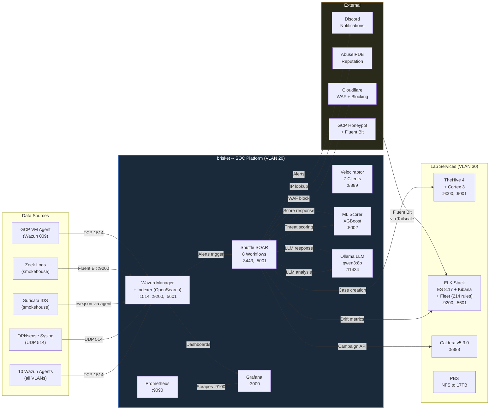
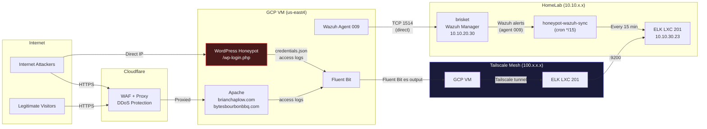

# Network Topology

**Author:** Brian Chaplow
**Last Updated:** 2026-02-19

Detailed network architecture for the HomeLab SOC v3 environment. Covers VLAN segmentation, firewall policy, switch ACL micro-segmentation, and data flow between all components.

---

## Table of Contents

- [VLAN Architecture](#vlan-architecture)
- [Host Inventory](#host-inventory)
- [OPNsense Interface Map](#opnsense-interface-map)
- [Firewall Rule Summary](#firewall-rule-summary)
- [MokerLink ACL Micro-Segmentation](#mokerlink-acl-micro-segmentation)
- [Physical Topology](#physical-topology)
- [Logical Topology](#logical-topology)
- [GCP External Connectivity](#gcp-external-connectivity)

---

## VLAN Architecture

The network is segmented into five 802.1Q VLANs plus two family network subnets, all routed through OPNsense with strict inter-VLAN policy enforcement. Each VLAN serves a distinct security function, enabling controlled east-west traffic between SOC tools, lab systems, and isolated attack targets.

| VLAN ID | Subnet | Gateway | Purpose | Notes |
|---------|--------|---------|---------|-------|
| 10 | 10.10.10.0/24 | 10.10.10.1 | Management | Firewall, switch, admin workstation |
| 20 | 10.10.20.0/24 | 10.10.20.1 | SOC Infrastructure | SIEM, SOAR, sensors, ML scoring, LLM inference |
| 30 | 10.10.30.0/24 | 10.10.30.1 | Lab / Proxmox / AD | Hypervisors, AD domain, TheHive, ELK, backup |
| 40 | 10.10.40.0/24 | 10.10.40.1 | Targets (ISOLATED) | Attack targets only -- no outbound except established |
| 50 | 10.10.50.0/24 | 10.10.50.1 | IoT | Internet-only, no lateral movement |
| -- | 192.168.100.0/24 | 192.168.100.1 | Family DMZ | ASUS router WAN-side, isolated from SOC VLANs |
| -- | 192.168.50.0/24 | 192.168.50.1 | Family LAN (WiFi) | Consumer devices, no SOC access |

### Design Rationale

- **VLAN 40 is fully isolated.** Targets cannot initiate connections to any other VLAN or the internet. Only established/related return traffic is permitted. This ensures attack exercises remain contained.
- **VLAN 20 houses all SOC tooling** on a dedicated subnet, separated from the lab hypervisors and AD domain on VLAN 30.
- **VLAN 50 (IoT)** has internet-only access with no lateral movement to any internal VLAN.
- **Family networks** are physically separated via the ASUS router connected to a dedicated OPNsense interface (igc3), completely isolated from SOC operations.

---

## Host Inventory

### VLAN 10 -- Management

| Hostname | IP | Hardware | Role |
|----------|----|----------|------|
| OPNsense | 10.10.10.1 | Protectli VP2420 (J6412, 8GB) | Firewall / router / VLAN gateway |
| MokerLink | 10.10.10.2 | 10G08410GSM (8x10GE + 4xSFP+) | L3 managed switch, 802.1Q trunking, port ACLs |
| PITBOSS | 10.10.10.100 | ASUS TUF Dash F15 (i7-12650H, 64GB) | Windows admin workstation |

### VLAN 20 -- SOC Infrastructure

| Hostname | IP | Hardware | Role |
|----------|----|----------|------|
| smokehouse | 10.10.20.10 | QNAP TVS-871 (i7-4790S, 16GB) | Sensor node -- Suricata IDS + Zeek on SPAN port |
| sear | 10.10.20.20 | ASUS ROG Strix G512LI (i7-10750H, 32GB, GTX 1650 Ti) | Kali attack box, ML model training |
| **brisket** | **10.10.20.30** | **Intel Ultra 9 285, 64GB, RTX A1000** | **Primary SOC platform -- Wazuh, Shuffle, Velociraptor, ML scorer, Ollama** |

### VLAN 30 -- Lab / Proxmox / AD

| Hostname | IP | Hardware / Resources | Role |
|----------|----|----------------------|------|
| pitcrew | 10.10.30.20 | ThinkStation P340 Tiny (i7-10700T, 32GB) | Proxmox host -- AD lab VMs, TheHive LXC, ELK LXC |
| smoker | 10.10.30.21 | ThinkStation P340 Tiny (i7-10700T, 32GB) | Proxmox host -- target VMs, Caldera, PBS LXC |
| TheHive LXC 200 | 10.10.30.22 | LXC on pitcrew (4 vCPU, 8GB) | TheHive 4 + Cortex 3 (case management, 5 analyzers) |
| ELK LXC 201 | 10.10.30.23 | LXC on pitcrew (6 vCPU, 10GB) | Elasticsearch 8.17, Kibana, Fleet Server, Logstash |
| PBS LXC 300 | 10.10.30.24 | LXC on smoker (2 vCPU, 2GB) | Proxmox Backup Server (NFS to smokehouse 17TB) |
| DC01 | 10.10.30.40 | VM on pitcrew (2 vCPU, 4GB) | Active Directory Domain Controller (Win Server 2022) |
| WS01 | 10.10.30.41 | VM on pitcrew (4 vCPU, 4GB) | AD Workstation (Windows 10) |

### VLAN 40 -- Targets (Isolated)

| Hostname | IP | Type | Role |
|----------|----|------|------|
| DVWA + Juice Shop | 10.10.40.10 | Proxmox VM | Web application targets |
| Metasploitable 3 (Linux) | 10.10.40.20 | Proxmox VM | Multi-service exploitation target |
| Metasploitable 3 (Win) | 10.10.40.21 | Proxmox VM | Multi-service exploitation target |
| WordPress | 10.10.40.30 | Docker on smoker (ipvlan L2) | WPScan target |
| crAPI | 10.10.40.31 | Docker on smoker (ipvlan L2) | REST API security target |
| vsftpd | 10.10.40.32 | Docker on smoker (ipvlan L2) | FTP exploitation target |
| Honeypot | 10.10.40.33 | Docker on smoker (ipvlan L2) | WAF evasion target |
| SMTP relay | 10.10.40.42 | Docker on smoker (ipvlan L2) | SMTP target |
| SNMPd | 10.10.40.43 | Docker on smoker (ipvlan L2) | SNMP target |

> **Note:** Docker targets on smoker use `ipvlan L2` networking to place containers directly on VLAN 40 (10.10.40.0/24) while the host itself remains on VLAN 30. This avoids NAT and gives each target a real routable IP within the isolated subnet.

### External

| Hostname | IP | Location | Role |
|----------|----|----------|------|
| GCP VM | External (Tailscale overlay) | Google Cloud (us-east4) | brianchaplow.com + bytesbourbonbbq.com hosting, Wazuh agent, honeypot |

---

## OPNsense Interface Map

OPNsense runs on a Protectli VP2420 appliance with four Intel i225/i226-V NICs. The primary uplink (igc0) carries an 802.1Q trunk to the MokerLink switch, with all five VLANs tagged on a single physical link.

| NIC | OPNsense Name | VLAN | IP Address | Connection |
|-----|---------------|------|------------|------------|
| igc0 | (trunk parent) | all | none | 802.1Q trunk to MokerLink switch |
| igc0_vlan10 | LAN | 10 | 10.10.10.1/24 | Management VLAN |
| vlan01 | SOC (opt1) | 20 | 10.10.20.1/24 | SOC infrastructure VLAN |
| vlan02 | Lab (opt2) | 30 | 10.10.30.1/24 | Lab / Proxmox / AD VLAN |
| vlan03 | Targets (opt3) | 40 | 10.10.40.1/24 | Attack targets VLAN |
| vlan04 | IoT (opt4) | 50 | 10.10.50.1/24 | IoT VLAN |
| igc1 | WAN | -- | DHCP | Verizon ISP uplink |
| igc3 | AsusRouter (opt5) | -- | 192.168.100.1/24 | Family network (ASUS router) |

### Key Interface Details

- **igc0** is the single physical uplink carrying all VLAN traffic to the switch. All sub-interfaces are created as VLAN tags on this trunk.
- **igc1 (WAN)** receives a public IP via DHCP from the ISP.
- **igc3** connects directly to the family ASUS router, creating a hard boundary between SOC and family traffic. No VLAN tagging -- this is a separate physical segment.

---

## Firewall Rule Summary

All inter-VLAN traffic routes through OPNsense, where stateful packet filtering (pf) enforces the following policy. VLAN 40 isolation is the cornerstone of the security architecture -- attack exercises never leak beyond the target subnet.

### Inter-VLAN Routing Policy

| Source | Destination | Action | Purpose |
|--------|-------------|--------|---------|
| VLAN 10 (Management) | All VLANs | ALLOW | Admin workstation needs full access |
| VLAN 20 (SOC) | VLAN 30 (Lab) | ALLOW | brisket communicates with TheHive, ELK, Proxmox |
| VLAN 20 (SOC) | VLAN 40 (Targets) | ALLOW | sear runs attacks against targets |
| VLAN 30 (Lab) | VLAN 20 (SOC) | ALLOW | TheHive/ELK report to Wazuh/Shuffle on brisket |
| VLAN 30 (Lab) | VLAN 40 (Targets) | ALLOW | smoker hosts Docker target containers on VLAN 40 |
| VLAN 40 (Targets) | ANY | **DENY** | Targets are fully isolated (established/related only) |
| VLAN 50 (IoT) | Internet only | ALLOW | No lateral movement to internal VLANs |
| Family (192.168.x.x) | SOC VLANs | **DENY** | Hard physical + logical separation |

### VLAN 40 Isolation Detail

VLAN 40 enforces a strict **deny-all outbound** policy with one exception: established/related return traffic is permitted. This means:

- Targets can **respond** to connections initiated from VLAN 20 (attack traffic) or VLAN 30 (management)
- Targets **cannot** initiate connections to the internet, other VLANs, or even other targets
- All attack exercises are fully contained within this subnet
- OPNsense syslog from VLAN 40 is forwarded to Wazuh for visibility

### Key Service Flows Through the Firewall

| Flow | Source | Destination | Ports | Purpose |
|------|--------|-------------|-------|---------|
| Wazuh agent reporting | All VLANs | brisket (10.10.20.30) | TCP 1514, 1515 | Agent enrollment and event shipping |
| OPNsense syslog | OPNsense (10.10.10.1) | brisket (10.10.20.30) | UDP 514 | Firewall log ingestion |
| Prometheus scraping | brisket (10.10.20.30) | All monitored hosts | TCP 9100 | Node exporter metrics collection |
| TheHive case management | brisket (10.10.20.30) | TheHive (10.10.30.22) | TCP 9000 | Shuffle creates/queries cases |
| ELK data shipping | brisket (10.10.20.30) | ELK (10.10.30.23) | TCP 9200 | Honeypot sync, drift metrics |
| Caldera C2 | smoker (10.10.30.21) | VLAN 40 targets | TCP 8888 | Sandcat agent communication |
| Zeek/Suricata shipping | smokehouse (10.10.20.10) | brisket (10.10.20.30) | TCP 9200 | Fluent Bit ships Zeek logs to OpenSearch |

---

## MokerLink ACL Micro-Segmentation

### The Problem

sear (10.10.20.20) and brisket (10.10.20.30) are both on VLAN 20. Intra-VLAN traffic is Layer 2 switched -- it **never routes through OPNsense**, so firewall rules do not apply. Without additional controls, a compromised sear could access every service on brisket (Shuffle SOAR, Grafana, Wazuh Dashboard, etc.).

### The Solution

The MokerLink 10G08410GSM L3 managed switch supports IPv4 ACLs bound to physical ports. ACL `sear-brisket` is bound to **TE4** (sear's physical switch port), filtering all traffic between the two hosts at the switch level.

### ACL Characteristics

- **Bidirectional enforcement:** The MokerLink applies port-bound ACLs to both ingress and egress traffic on the bound port. There is no direction selector in the binding UI.
- **Stateless evaluation:** Unlike OPNsense's stateful pf firewall, switch ACLs do not track TCP connections. A SYN and its SYN-ACK are evaluated independently. This means every brisket-initiated connection to sear requires **two rules**: one for the outbound request (matching destination port) and one for the inbound return (matching source port).
- **Default action:** Implicit deny at the end of the ACL. An explicit catch-all PERMIT (seq 50) allows all non-sear-to-brisket traffic to pass normally.

### ACL Rules -- `sear-brisket` on TE4

| Seq | Action | Proto | Source IP | Destination IP | Src Port | Dst Port | Purpose |
|-----|--------|-------|-----------|----------------|----------|----------|---------|
| 10 | PERMIT | TCP | 10.10.20.20 | 10.10.20.30 | Any | 1514 | sear to brisket: Wazuh agent |
| 20 | PERMIT | TCP | 10.10.20.20 | 10.10.20.30 | Any | 1515 | sear to brisket: Wazuh enrollment |
| 30 | PERMIT | TCP | 10.10.20.20 | 10.10.20.30 | Any | 9200 | sear to brisket: OpenSearch queries |
| 31 | PERMIT | TCP | 10.10.20.30 | 10.10.20.20 | Any | 9100 | brisket to sear: Prometheus scrape |
| 32 | PERMIT | TCP | 10.10.20.30 | 10.10.20.20 | Any | 22 | brisket to sear: SSH management |
| 33 | PERMIT | TCP | 10.10.20.20 | 10.10.20.30 | 9100 | Any | sear to brisket: Prometheus **return** |
| 34 | PERMIT | TCP | 10.10.20.20 | 10.10.20.30 | 22 | Any | sear to brisket: SSH **return** |
| 40 | **DENY** | IP | 10.10.20.20 | 10.10.20.30 | Any | Any | Block all other sear to brisket |
| 50 | PERMIT | IP | Any | Any | Any | Any | Allow all non-matching traffic |

### How Stateless Return Rules Work

Because the ACL is stateless, brisket-initiated connections to sear need explicit return-path rules. Here is how the rule evaluation works for each flow:

**Prometheus scrape (brisket:ephemeral to sear:9100):**
1. Outbound SYN exits TE4 -- matches seq 31 (dst port 9100) -- PERMIT
2. Return SYN-ACK enters TE4 from sear with **src port 9100** -- matches seq 33 -- PERMIT
3. Without seq 33, the return would fall through to seq 40 (DENY)

**SSH (brisket to sear:22):**
1. Outbound SYN exits TE4 -- matches seq 32 (dst port 22) -- PERMIT
2. Return SYN-ACK enters TE4 from sear with **src port 22** -- matches seq 34 -- PERMIT

**Blocked example -- sear to brisket:3000 (Grafana):**
1. Packet enters TE4 inbound from sear -- no match on seq 10-34 -- hits seq 40 DENY

**Blocked example -- brisket pings sear (ICMP):**
1. Outbound ICMP exits TE4 -- matches seq 50 PERMIT (catch-all)
2. ICMP reply enters TE4 from sear -- IP protocol, matches seq 40 DENY
3. Ping is **intentionally blocked** by design

### Verification Results

| Test | From | To | Expected | Result |
|------|------|----|----------|--------|
| Prometheus scrape :9100 | brisket | sear | PASS | PASS |
| OpenSearch :9200 | sear | brisket | PASS | PASS |
| Grafana :3000 | sear | brisket | BLOCKED | BLOCKED |
| SSH :22 | sear | brisket | BLOCKED | BLOCKED |
| ICMP ping | brisket | sear | BLOCKED | BLOCKED |
| Prometheus all 6 targets | brisket | all hosts | ALL UP | ALL UP |

---

## Physical Topology

```mermaid
graph TB
    subgraph Internet
        ISP["Verizon ISP"]
        CF["Cloudflare CDN"]
    end

    subgraph Family["Family Network (Physical Separation)"]
        ASUS["ASUS Router<br/>192.168.100.1"]
        WIFI["Family WiFi<br/>192.168.50.0/24"]
    end

    subgraph Firewall["OPNsense Firewall (Protectli VP2420)"]
        OPN["OPNsense<br/>igc1=WAN | igc0=Trunk | igc3=ASUS"]
    end

    subgraph Switch["MokerLink 10G08410GSM"]
        SW["L3 Managed Switch<br/>10.10.10.2<br/>802.1Q Trunk + Port ACLs"]
    end

    subgraph VLAN10["VLAN 10 -- Management (10.10.10.0/24)"]
        PITBOSS["PITBOSS<br/>10.10.10.100<br/>Admin Workstation"]
    end

    subgraph VLAN20["VLAN 20 -- SOC Infrastructure (10.10.20.0/24)"]
        SMOKEHOUSE["smokehouse<br/>10.10.20.10<br/>Suricata + Zeek<br/>(TE9 + TE10 SPAN)"]
        SEAR["sear<br/>10.10.20.20<br/>Kali + ML Training<br/>(TE4, ACL applied)"]
        BRISKET["brisket<br/>10.10.20.30<br/>SOC Platform<br/>(TE7)"]
    end

    subgraph VLAN30["VLAN 30 -- Lab / Proxmox / AD (10.10.30.0/24)"]
        PITCREW["pitcrew<br/>10.10.30.20<br/>Proxmox (TE2)"]
        SMOKER["smoker<br/>10.10.30.21<br/>Proxmox (TE3 trunk)"]
        THEHIVE["TheHive LXC 200<br/>10.10.30.22"]
        ELK["ELK LXC 201<br/>10.10.30.23"]
        PBS["PBS LXC 300<br/>10.10.30.24"]
        DC01["DC01<br/>10.10.30.40"]
        WS01["WS01<br/>10.10.30.41"]
    end

    subgraph VLAN40["VLAN 40 -- Targets / ISOLATED (10.10.40.0/24)"]
        DVWA["DVWA + Juice Shop<br/>10.10.40.10"]
        MS3L["Metasploitable 3<br/>10.10.40.20"]
        MS3W["Metasploitable 3 Win<br/>10.10.40.21"]
        WP["WordPress<br/>10.10.40.30"]
        CRAPI["crAPI<br/>10.10.40.31"]
        FTP["vsftpd<br/>10.10.40.32"]
        HONEYPOT["Honeypot<br/>10.10.40.33"]
        SMTP["SMTP<br/>10.10.40.42"]
        SNMP["SNMPd<br/>10.10.40.43"]
    end

    ISP -->|"igc1 (WAN)"| OPN
    OPN -->|"igc3"| ASUS
    ASUS --- WIFI
    OPN -->|"igc0 (802.1Q trunk)<br/>VLANs 10/20/30/40/50"| SW

    SW --- PITBOSS
    SW -->|"TE9 + TE10 (SFP+)"| SMOKEHOUSE
    SW -->|"TE4 (ACL: sear-brisket)"| SEAR
    SW -->|"TE7"| BRISKET
    SW -->|"TE2"| PITCREW
    SW -->|"TE3 (VLAN 30+40 trunk)"| SMOKER

    PITCREW -.->|"LXC"| THEHIVE
    PITCREW -.->|"LXC"| ELK
    PITCREW -.->|"VM"| DC01
    PITCREW -.->|"VM"| WS01
    SMOKER -.->|"LXC"| PBS
    SMOKER -.->|"ipvlan L2 (VLAN 40)"| WP
    SMOKER -.->|"ipvlan L2"| CRAPI
    SMOKER -.->|"ipvlan L2"| FTP
    SMOKER -.->|"ipvlan L2"| HONEYPOT
    SMOKER -.->|"ipvlan L2"| SMTP
    SMOKER -.->|"ipvlan L2"| SNMP

    CF -->|"Internet"| ISP

    style VLAN40 fill:#4a1a1a,stroke:#ff4444,color:#fff
    style BRISKET fill:#1a3a1a,stroke:#44ff44,color:#fff
```

### SPAN Port Monitoring

smokehouse connects to the MokerLink switch via two SFP+ uplinks:

- **TE9** -- Primary data connection (VLAN 20)
- **TE10** -- SPAN capture port (all switch ports mirrored, no IP address assigned)

All traffic crossing the switch is mirrored to TE10, where smokehouse runs **Suricata** (IDS alerting) and **Zeek** (connection metadata extraction) against the full-take packet capture.

---

## Logical Topology

### Data Flow Narrative

1. **Collection:** 10 Wazuh agents across all VLANs ship security events to the Wazuh Manager on brisket via TCP 1514. OPNsense forwards firewall syslog via UDP 514. smokehouse runs Suricata and Zeek against SPAN traffic, with Suricata alerts shipped through the Wazuh agent and Zeek metadata shipped directly to OpenSearch via Fluent Bit.

2. **Detection:** Wazuh correlates events against custom rules and generates alerts stored in OpenSearch (`wazuh-alerts-*`). ELK runs 214 Elastic detection rules against Fleet agent data independently.

3. **Automation:** Shuffle SOAR orchestrates 8 workflows triggered by webhooks and system cron schedules:
   - **WF1** -- Threat enrichment (AbuseIPDB + ML score) and auto-block (Cloudflare WAF)
   - **WF2** -- Watch turnover digest (twice daily summary to Discord)
   - **WF3** -- Detection gap analysis (Caldera campaigns vs. Wazuh coverage)
   - **WF5** -- Daily alert cluster triage (LLM-powered grouping)
   - **WF6** -- ML model drift detection (daily metrics to ELK)
   - **WF7** -- Weekly honeypot intelligence report
   - **WF8** -- LLM log anomaly finder (rare pattern classification)

4. **Response:** TheHive manages incident cases created by Shuffle. Cortex runs 5 analyzers for enrichment. Velociraptor provides endpoint DFIR across 7 clients.

5. **Adversary Simulation:** Caldera v5.3.0 on smoker runs MITRE ATT&CK campaigns against VLAN 40 targets with Sandcat agents, validating Wazuh detection coverage.

---

## GCP External Connectivity

### GCP Pipeline Details

The GCP VM serves dual purposes: hosting the public portfolio and BBQ blog sites behind Cloudflare, and running a WordPress login honeypot for security research (INST 570).

**Honeypot data flow:**
1. Attackers interact with the fake `/wp-login.php` page, submitting credentials
2. The PHP honeypot logs each attempt to `/var/log/honeypot/credentials.json`
3. Apache logs all access to `/var/log/apache2/honeypot-access.log`
4. **Fluent Bit** on the GCP VM ships both log streams to ELK LXC 201 via Tailscale (100.x.x.x mesh network), writing to `honeypot-credentials` and `honeypot-access` indices
5. The Wazuh agent (agent 009) independently ships OS-level security events to brisket's Wazuh Manager
6. A cron job on brisket (`honeypot-wazuh-sync.py`, every 15 minutes) copies agent 009 alerts from Wazuh's OpenSearch to the `honeypot-wazuh` index in ELK for unified honeypot analysis

**Why Tailscale?** The GCP VM has no direct route to the home network's RFC 1918 address space (10.10.x.x). Tailscale provides a WireGuard-based mesh VPN, assigning each node a stable 100.x.x.x address and handling NAT traversal automatically. No port forwarding or public exposure of ELK is required.

**ELK Honeypot Indices:**

| Index | Contents | Source |
|-------|----------|--------|
| `honeypot-credentials` | Credential capture events (username, password, source IP) | Fluent Bit on GCP VM |
| `honeypot-access` | Apache access logs for honeypot vhost | Fluent Bit on GCP VM |
| `honeypot-wazuh` | Wazuh alerts for GCP VM (agent 009) | honeypot-wazuh-sync.py on brisket |
| `apache-parsed-v2` | Portfolio + BBQ site access logs | Fluent Bit on GCP VM |

---

## Design Principles

1. **Defense in depth.** Network segmentation operates at three layers: OPNsense inter-VLAN firewall rules, MokerLink switch port ACLs for intra-VLAN microsegmentation, and host-level Wazuh agents for endpoint detection.

2. **Least privilege routing.** VLAN 40 targets cannot initiate any outbound connections. IoT devices (VLAN 50) can only reach the internet. The attack box (sear) is microsegmented from the SOC platform (brisket) at the switch level.

3. **Full visibility.** SPAN port mirroring captures all switch traffic for Suricata/Zeek analysis. 10 Wazuh agents cover every VLAN. Prometheus scrapes 6 infrastructure targets. Every layer generates telemetry.

4. **Separation of concerns.** SOC tooling (VLAN 20), lab infrastructure (VLAN 30), and attack targets (VLAN 40) occupy distinct broadcast domains with explicit policy governing cross-VLAN communication.

5. **External integration without exposure.** The GCP honeypot ships data home via Tailscale mesh VPN, requiring zero inbound port exposure on the home network.
