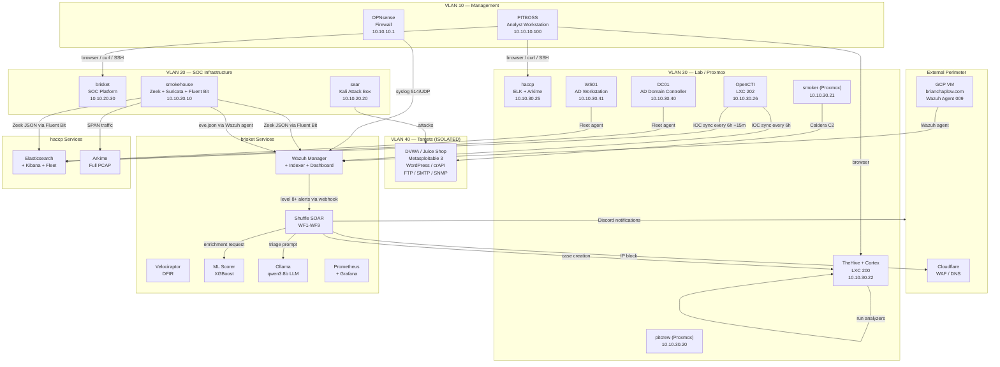

# SOC Analyst Playbook Enrichment — Implementation Plan

> **For agentic workers:** REQUIRED: Use superpowers:subagent-driven-development (if subagents available) or superpowers:executing-plans to implement this plan. Steps use checkbox (`- [ ]`) syntax for tracking.

**Goal:** Enrich the SOC analyst HTML playbook (`~/.soc-playbook/soc-playbook.md`) with tool overviews, architecture context, result interpretation, decision guidance, and a reference appendix — transforming it from a command reference into an intern-ready operational handbook.

**Architecture:** The playbook is a single 5,278-line markdown file that compiles to HTML via `docs/guides/build-playbook.py`. All changes are markdown edits to `~/.soc-playbook/soc-playbook.md` (the private source of truth) plus one build script update for Mermaid support. The repo copy at `docs/guides/soc-playbook.md` is not touched (it has credential placeholders and is updated separately).

**Tech Stack:** Markdown, Python (`build-playbook.py`), Mermaid.js (CDN), HTML/CSS/JS

**Spec:** `docs/superpowers/specs/2026-03-17-playbook-enrichment-design.md`

---

## File Map

| File | Action | Purpose |
|------|--------|---------|
| `~/.soc-playbook/soc-playbook.md` | Modify | The playbook — all content changes |
| `docs/guides/build-playbook.py` | Modify | Add Mermaid.js CDN script tag |

**Important constraints:**
- The private playbook at `~/.soc-playbook/soc-playbook.md` is the working file. It contains real credentials. It is NOT in the git repo.
- The repo copy (if any) uses `<PLACEHOLDER>` tokens. We do not modify the repo copy in this plan.
- After all content is written, regenerate the HTML with `python docs/guides/build-playbook.py`.
- Commits only apply to the build script change (Task 1) and are noted there. Playbook content changes are not committed (private file).
- **Capitol Signals (WF-CS1) is out of scope.** It is a separate project. If you encounter CS1 references or the `$discord_webhook_cs` variable during enrichment, do not document it in the playbook.
- **All GUI walkthroughs must be precise enough for Chrome Claude extension prompting.** Write step-by-step navigation instructions with specific menu paths, button names, and filter values — not vague "explore the dashboard" guidance.

---

## Section Renumbering Reference

Every cross-reference in the existing playbook must be updated when new sections are inserted.

| Old # | New # | Title |
|-------|-------|-------|
| 1 | 1 | Quick Access Reference |
| — | 2 | SOC Architecture & Data Flow (NEW) |
| — | 3 | Your SOC Stack (NEW) |
| 2 | 4 | Daily Operations Checklist |
| 3 | 5 | Working with Alerts |
| 4 | 6 | Triaging and Escalating Alerts |
| 5 | 7 | Investigating Alerts |
| 6 | 8 | Responding to Alerts |
| 7 | 9 | TheHive Case Management |
| 8 | 10 | SOAR Workflow Operations |
| 9 | 11 | Adversary Simulation Operations |
| 10 | 12 | Scenario Runbooks |
| 11 | 13 | Troubleshooting |
| 12 | 14 | API & Query Reference |
| — | 15 | Appendix — SOC Analyst Reference (NEW) |

---

## Task 1: Build Pipeline — Mermaid Support

**Files:**
- Modify: `docs/guides/build-playbook.py` (lines 370-426, the `<script>` section of the HTML template)

This is the only git-tracked change. Do it first so subsequent HTML regenerations render the diagram.

- [ ] **Step 1: Add Mermaid.js CDN script to the interactive HTML template**

In `build-playbook.py`, find the closing `</script>` tag (line ~423) in the interactive HTML template. Add the Mermaid CDN script and initialization immediately before the closing `</body>` tag:

```python
# After the existing </script> tag (line ~423), before </body>:
<script src="https://cdn.jsdelivr.net/npm/mermaid@11/dist/mermaid.min.js"></script>
<script>
mermaid.initialize({{
  startOnLoad: true,
  theme: 'dark',
  themeVariables: {{
    primaryColor: '#1f6feb',
    primaryTextColor: '#e6edf3',
    primaryBorderColor: '#30363d',
    lineColor: '#58a6ff',
    secondaryColor: '#161b22',
    tertiaryColor: '#1c2128'
  }}
}});
</script>
```

Note: Double curly braces `{{` are required because this is inside an f-string in Python.

Also add Mermaid rendering support to the print HTML template (for PDF generation). Add before the closing `</body>` in the print template:

```python
<script src="https://cdn.jsdelivr.net/npm/mermaid@11/dist/mermaid.min.js"></script>
<script>mermaid.initialize({{ startOnLoad: true, theme: 'default' }});</script>
```

- [ ] **Step 2: Verify the build script runs without errors**

Run: `python docs/guides/build-playbook.py`
Expected: "HTML written to ... bytes" with no errors.

- [ ] **Step 3: Commit the build script change**

```bash
git add docs/guides/build-playbook.py
git commit -m "Add Mermaid.js rendering to playbook HTML builder"
```

---

## Task 2: Section Renumbering & TOC Update

**Files:**
- Modify: `~/.soc-playbook/soc-playbook.md` (lines 66-82 TOC, plus all `## N.` headers and cross-references)

Renumber all existing sections to make room for the two new sections (2 and 3) and update every internal cross-reference.

- [ ] **Step 1: Update the Table of Contents**

Replace the existing TOC (lines 66-79) with the new 15-section TOC:

```markdown
## Table of Contents

- [1. Quick Access Reference](#1-quick-access-reference)
- [2. SOC Architecture & Data Flow](#2-soc-architecture--data-flow)
- [3. Your SOC Stack](#3-your-soc-stack)
- [4. Daily Operations Checklist](#4-daily-operations-checklist)
- [5. Working with Alerts](#5-working-with-alerts)
- [6. Triaging and Escalating Alerts](#6-triaging-and-escalating-alerts)
- [7. Investigating Alerts](#7-investigating-alerts)
- [8. Responding to Alerts](#8-responding-to-alerts)
- [9. TheHive Case Management (NIST 800-61 Aligned)](#9-thehive-case-management-nist-800-61-aligned)
- [10. SOAR Workflow Operations](#10-soar-workflow-operations)
- [11. Adversary Simulation Operations](#11-adversary-simulation-operations)
- [12. Scenario Runbooks](#12-scenario-runbooks)
- [13. Troubleshooting](#13-troubleshooting)
- [14. API & Query Reference](#14-api--query-reference)
- [15. Appendix — SOC Analyst Reference](#15-appendix--soc-analyst-reference)
```

- [ ] **Step 2: Renumber all section headers**

Change every `## N.` header per the renumbering table. Also renumber `### N.X` subsection headers. Key changes:

| Find | Replace |
|------|---------|
| `## 2. Daily Operations` | `## 4. Daily Operations` |
| `## 3. Working with Alerts` | `## 5. Working with Alerts` |
| `### 3.1 Alert Severity` | `### 5.1 Alert Severity` |
| `### 3.2 Wazuh Dashboard` | `### 5.2 Wazuh Dashboard` |
| `### 3.3 OpenSearch Query` | `### 5.3 OpenSearch Query` |
| `### 3.4 ELK Elasticsearch` | `### 5.4 ELK Elasticsearch` |
| `### 3.5 Reading Shuffle` | `### 5.5 Reading Shuffle` |
| `## 4. Triaging` | `## 6. Triaging` |
| `### 4.1` through `### 4.6` | `### 6.1` through `### 6.6` |
| `## 5. Investigating` | `## 7. Investigating` |
| `### 5.1` through `### 5.5` | `### 7.1` through `### 7.5` |
| `## 6. Responding` | `## 8. Responding` |
| `### 6.1` through `### 6.3` | `### 8.1` through `### 8.3` |
| `## 7. TheHive` | `## 9. TheHive` |
| `### 7.1` through `### 7.7` | `### 9.1` through `### 9.7` |
| `## 8. SOAR` | `## 10. SOAR` |
| `### 8.1` through `### 8.7` | `### 10.1` through `### 10.7` |
| `## 9. Adversary` | `## 11. Adversary` |
| `### 9.1` through `### 9.4` | `### 11.1` through `### 11.4` |
| `## 10. Scenario Runbooks` | `## 12. Scenario Runbooks` |
| `## 11. Troubleshooting` | `## 13. Troubleshooting` |
| `### 11.1` through `### 11.6` | `### 13.1` through `### 13.6` |
| `## 12. API` | `## 14. API` |
| `### 12.1` through `### 12.10` | `### 14.1` through `### 14.10` |

**CRITICAL:** Do NOT renumber headings inside fenced code blocks (e.g., the AAR template in what will become Section 9.7). Only renumber headings that are actual playbook sections.

- [ ] **Step 3: Update all internal cross-references**

Search the file for every `Section \d` reference and update per the renumbering table. Known references to update:

| Location (approx old line) | Old Reference | New Reference |
|---------------------------|---------------|---------------|
| ~223 | Section 1.5 | Section 1.5 (unchanged) |
| ~1389 | Section 7.3 | Section 9.3 |
| ~1404 | Section 4.5 | Section 6.5 |
| ~1406 | Section 4.4 | Section 6.4 |
| ~2037 | Section 7 | Section 9 |
| ~2110 | NIST 800-61 Section 3 | NIST 800-61 Section 3 (external ref, do NOT change) |
| ~2368 | NIST 800-61 Section 3.4 | NIST 800-61 Section 3.4 (external ref, do NOT change) |
| ~2499 | Section 8 | Section 10 |
| ~2563 | section 8.0 | section 10.0 |
| ~4047 | Section 1.5 | Section 1.5 (unchanged) |

Also update any `section X.Y` references in lowercase. Do NOT change NIST 800-61 references — those refer to the external standard, not playbook sections.

- [ ] **Step 4: Verify no broken references remain**

Search for all `[Ss]ection \d` references and verify each one points to the correct new section number. The easiest method: search the file for the pattern and manually verify each hit.

---

## Task 3: Section 2 — SOC Architecture & Data Flow

**Files:**
- Modify: `~/.soc-playbook/soc-playbook.md` (insert after the `---` following Section 1, before what is now Section 4)

Insert the entire new Section 2 between Section 1 and Section 4 (formerly Section 2).

- [ ] **Step 1: Write Section 2.1 — Architecture Diagram**

Insert after the `---` line that follows Section 1 (around line 196 in the renumbered file). Write a Mermaid C4 container diagram. Use `graph TB` (top-to-bottom) with subgraphs for each layer:

```markdown
## 2. SOC Architecture & Data Flow

This section provides the big-picture view of how data flows through the SOC — from collection to response. Read this before diving into the operational sections.

### 2.1 Architecture Diagram


```

Verify: After building the HTML, this should render as a diagram (not a code block) because of the Mermaid.js include from Task 1.

- [ ] **Step 2: Write Section 2.2 — Alert Lifecycle Phase Table**

```markdown
### 2.2 Alert Lifecycle

Every alert flows through these phases. The table maps each phase to the tools involved and the playbook section where you operate on it.

| Phase | What Happens | Tools | Playbook Section |
|-------|-------------|-------|-----------------|
| **Collection** | Agents ship logs, network sensors capture traffic, PCAP stored | Wazuh agents (12), Zeek, Suricata, Fluent Bit, Fleet agents, Arkime | Section 5 (Alerts), Section 14 (API Reference) |
| **Detection** | Rules match patterns, alerts fire | Wazuh custom + built-in rules, ELK detection rules (214) | Section 5.1 (Severity Scale), Section 7.5 (ELK Cross-Ref) |
| **Enrichment** | Threat intel lookup, ML scoring, LLM triage | Shuffle WF1, ML Scorer, Ollama, AbuseIPDB, OpenCTI | Section 6 (Triaging), Section 10.1 (WF1) |
| **Triage** | Classify severity, dedup, decide escalation | Shuffle WF1/WF5, escalation matrix | Section 6.4 (Escalation Matrix) |
| **Investigation** | Correlate across network, endpoint, PCAP | Zeek indices, Arkime sessions, Velociraptor hunts, Cortex analyzers, Wazuh FIM | Section 7 (Investigating) |
| **Response** | Block IPs, isolate endpoints, create cases | Cloudflare WAF, OPNsense, Wazuh Active Response, TheHive | Section 8 (Responding), Section 9 (TheHive) |
| **Closure** | Resolve case, write after-action report | TheHive case workflow, NIST 800-61 tasks | Section 9.6 (Closure), Section 9.7 (AAR) |
| **Emulation** | Run attacks, validate detections, find gaps | Caldera, run_attack.sh, Detection Gap Analyzer (WF3) | Section 11 (Adversary Sim) |
```

- [ ] **Step 3: Write Section 2.3 — Network Context**

```markdown
### 2.3 Network Context

The SOC monitors 5 VLANs. The key thing to remember: **VLAN 40 is the only place attacks should happen.** If you see attack traffic on any other VLAN, that is a real incident.

| VLAN | Subnet | What Lives There | Your Interaction |
|------|--------|-----------------|-----------------|
| 10 | 10.10.10.0/24 | OPNsense firewall, MokerLink switch, PITBOSS | You sit here. Management traffic. |
| 20 | 10.10.20.0/24 | brisket (SOC core), smokehouse (sensors), sear (Kali) | Most of your API calls hit this VLAN. |
| 30 | 10.10.30.0/24 | Proxmox hosts, TheHive, ELK/Arkime (haccp), OpenCTI, AD lab | Investigation and case management tools. |
| 40 | 10.10.40.0/24 | DVWA, Metasploitable, WordPress, crAPI, FTP, SMTP, SNMP | **ISOLATED.** All attacks target here. Never on other VLANs. |
| 50 | 10.10.50.0/24 | IoT devices | Internet-only. Monitored but rarely investigated. |

The family network (192.168.100.0/24 DMZ, 192.168.50.0/24 WiFi) is behind the ASUS router and out of SOC scope.
```

- [ ] **Step 4: Write Section 2.4 — External Perimeter**

```markdown
### 2.4 External Perimeter

Two external assets are monitored by the SOC:

**GCP VM** — Hosts the public websites (brianchaplow.com, bytesbourbonbbq.com). Runs Wazuh agent 009, which reports alerts back to brisket over Tailscale. Previously hosted the WordPress honeypot (campaign ended 2026-03-12). Historical honeypot data is preserved in ELK indices on haccp.

**Cloudflare** — Provides WAF (Web Application Firewall) and DNS for the public sites. When Shuffle WF1 identifies a confirmed malicious external IP (AbuseIPDB confidence >= 90, reports >= 5, not whitelisted), it automatically creates a Cloudflare firewall block rule via the API. You can also manually block IPs — see Section 8.1.

Both generate alerts that flow through the standard Wazuh pipeline. GCP alerts appear as agent 009 in Wazuh Dashboard. Cloudflare WAF events appear in the GCP VM's access logs.

---
```

- [ ] **Step 5: Verify Section 2 renders correctly**

Run: `python docs/guides/build-playbook.py`
Open `~/.soc-playbook/soc-playbook.html` in Chrome. Verify:
- The Mermaid diagram renders as a visual diagram (not a code block)
- The phase table renders correctly
- The VLAN table renders correctly
- Sidebar navigation shows Section 2 and its subsections

---

## Task 4: Section 3 — Your SOC Stack (Detection & Collection: 3.1-3.6)

**Files:**
- Modify: `~/.soc-playbook/soc-playbook.md` (insert after Section 2, before Section 4)

Write the first 6 tool entries. Each follows the 6-point template from the spec. GUI walkthroughs must be precise enough for Chrome Claude extension prompting.

- [ ] **Step 1: Write the Section 3 header and intro**

```markdown
## 3. Your SOC Stack

This section introduces every tool in the SOC. For each tool, you will learn what it is, what it does here, where to access it, how it connects to other tools, how to navigate its interface, and the key concepts you need to operate it.

The tools are grouped by their role in the alert lifecycle (see Section 2.2):

- **Detection & Collection** (3.1-3.6): Tools that generate and gather data
- **Enrichment & Orchestration** (3.7-3.10): Tools that add context and automate workflows
- **Investigation & Response** (3.11-3.14): Tools for deep-dive analysis and taking action
- **Monitoring** (3.15-3.16): Tools for infrastructure health visibility
- **Infrastructure** (3.17-3.22): The platforms everything runs on
```

- [ ] **Step 2: Write 3.1 — Wazuh (SIEM/XDR)**

Write the full 6-point entry for Wazuh. This is the largest entry — Wazuh is the core SIEM. Cover:
- **What it is:** Open-source SIEM/XDR platform (Security Information and Event Management / Extended Detection and Response)
- **What it does in this SOC:** Central detection engine. 12 agents ship logs to the Wazuh Manager on brisket. Manager runs custom + built-in rules against incoming events. Alerts stored in the Wazuh Indexer (OpenSearch). Dashboard provides search, visualization, and agent management.
- **Where it runs:** brisket (10.10.20.30). Manager on ports 1514/1515 (agent registration), 514/UDP (syslog from OPNsense), 55000 (REST API). Indexer on 9200. Dashboard on 5601 (HTTPS). Login: admin / YOUR_PASSWORD.
- **How it fits in the pipeline:** Collection + Detection phases. Agents and syslog feed in. Level 8+ alerts trigger Shuffle WF1 via webhook. Zeek data also stored in the Indexer (queried as `zeek-*` indices). OpenCTI pushes IOCs to Wazuh CDB lists every 6 hours for rule matching.
- **GUI Walkthrough:** Step-by-step for: (1) Login and landing page, (2) Security Events module — how to filter by time range, agent, rule level, (3) Agents tab — viewing individual agent status and events, (4) Rules management — viewing active rules, custom rules (group: local), (5) Management > Configuration — viewing ossec.conf.
- **Key Concepts:** Agent (software running on each monitored host that ships logs), Decoder (parses raw log lines into structured fields), Rule (pattern matching on decoded fields — fires an alert when matched), Rule Level (0-15 severity scale), Rule ID (unique identifier per rule, custom rules start at 9000001+), CDB List (Constant Database list — flat file of IOCs for rule matching), Active Response (automated actions like firewall-drop triggered by rules), FIM/Syscheck (File Integrity Monitoring — detects file changes on agents).

- [ ] **Step 3: Write 3.2 — Elastic Stack**

Full 6-point entry. Cover:
- ES 8.17 + Kibana + Fleet + Logstash on haccp bare metal (10.10.30.25)
- Kibana HTTP on 5601, ES HTTPS on 9200 (self-signed CA)
- 4 Fleet agents (DC01, WS01 via Windows Security integration), 214 detection rules
- Elastic ML anomaly detection (trial license, auth-anomalies job on Windows Security events)
- GUI Walkthrough: Kibana Discover (index patterns, time range, KQL filters), Dashboards, Fleet > Agents, Security > Detection Rules, ML > Anomaly Detection
- Key Concepts: Index / data stream, KQL (Kibana Query Language), Fleet agent (Elastic agent that ships data to ES), Detection rule (EQL/KQL/threshold rule that generates alerts), ML anomaly job (baseline learning, anomaly scoring)

- [ ] **Step 4: Write 3.3 — Zeek**

Full 6-point entry. Cover:
- Network metadata analyzer (not full PCAP — that is Arkime)
- Runs on smokehouse (10.10.20.10), monitors SPAN port eth4
- Produces structured JSON logs: conn, http, dns, ssl, files, x509
- Shipped to brisket Wazuh Indexer AND haccp ELK via Fluent Bit
- CLI Key Commands: check Zeek is running (`ssh bchaplow@10.10.20.10` then `sudo zeekctl status`), view recent logs
- Key Concepts: conn.log (connection records), uid (unique connection ID linking logs together), conn_state (see Appendix D), community_id (cross-tool correlation hash)

- [ ] **Step 5: Write 3.4 — Suricata**

Full 6-point entry. Cover:
- Network IDS (Intrusion Detection System) — rule-based signature matching
- Runs on smokehouse alongside Zeek, monitors same SPAN port
- Produces eve.json (alert events), shipped to Wazuh via the smokehouse Wazuh agent
- CLI Key Commands: check status, view alert stats
- Key Concepts: Signature (pattern matching rule), SID (Signature ID), Alert vs. Drop vs. Pass actions, eve.json (unified JSON log format)

- [ ] **Step 6: Write 3.5 — Fluent Bit**

Full 6-point entry. Cover:
- Lightweight log shipper / pipeline processor
- Runs on smokehouse (ships Zeek logs to both brisket Wazuh Indexer and haccp ELK) and GCP VM (ships honeypot data to haccp ELK)
- Configuration-driven (no GUI) — `fluent-bit.conf` defines inputs, parsers, filters, outputs
- CLI Key Commands: check service status, view config, check output health
- Key Concepts: Input plugin (where logs come from), Output plugin (where logs go), Filter (transform or enrich in-flight), Parser (extract structured fields from raw text)

- [ ] **Step 7: Write 3.6 — OpenCTI**

Full 6-point entry. Cover:
- Open-source threat intelligence platform (STIX/TAXII)
- Runs on pitcrew LXC 202 (10.10.30.26:8080). Login: admin@opencti.local / YOUR_PASSWORD
- 6 connectors: MITRE ATT&CK, CVE (NVD), AbuseIPDB, CISA KEV, Malpedia, AlienVault OTX
- IOC sync pipeline: cron on brisket pushes indicators to Wazuh CDB lists (every 6h) and to haccp ELK (every 6h offset 15min)
- GUI Walkthrough: Dashboard, Threats > Indicators (IOCs), Data > Connectors (status, last run), Analysis > Reports
- Key Concepts: STIX (Structured Threat Information Expression — standard format for threat intel), Indicator (IOC — IP, domain, hash, URL), Connector (plugin that imports data from external sources), Observable (raw data point before it becomes an indicator)

- [ ] **Step 8: Verify section 3.1-3.6 renders correctly**

Run: `python docs/guides/build-playbook.py`
Open the HTML. Verify all 6 tool entries appear in the sidebar and render correctly.

---

## Task 5: Section 3 — Your SOC Stack (Enrichment & Orchestration: 3.7-3.10)

**Files:**
- Modify: `~/.soc-playbook/soc-playbook.md` (append to Section 3, after 3.6)

- [ ] **Step 1: Write 3.7 — Shuffle (SOAR)**

Full 6-point entry. Cover:
- Security Orchestration, Automation, and Response platform
- Runs on brisket (10.10.20.30). UI on 3443 (HTTPS), API on 5001 (HTTP). Login: admin / YOUR_PASSWORD
- 9 active workflows (WF1 through WF9, WF4 planned). All credentials use `$varname` workflow variables — never hardcoded.
- WF4 (Velociraptor auto-triage) is planned but not yet implemented — roadmap item
- GUI Walkthrough: Workflows list (enabled/disabled toggle), Workflow Editor (drag-and-drop nodes, action configuration), Execution History (per-workflow, expandable steps, success/failure), Workflow Variables (Settings > Variables — where all credentials live)
- Key Concepts: Workflow (sequence of automated actions), Action/Node (single step — HTTP request, Python code, conditional branch), Trigger (what starts a workflow — webhook, schedule, manual), Execution (one run of a workflow — timestamped, with per-step results), Workflow Variable (`$varname` — centralized credential storage, substituted at runtime)

- [ ] **Step 2: Write 3.8 — ML Scorer (XGBoost)**

Full 6-point entry. Cover:
- REST API serving an XGBoost binary classifier for threat detection
- Runs on brisket:5002 as a Docker container (`ml-scorer`)
- Trained on labeled Caldera attack data, PR-AUC 0.9998
- Takes alert fields (src_ip, dst_ip, dst_port, protocol, rule_level, rule_id) and returns a threat probability (0.0-1.0)
- Called by Shuffle WF1 during enrichment and WF6 for drift monitoring
- CLI Key Commands: `curl http://10.10.20.30:5002/health`, `curl -X POST http://10.10.20.30:5002/score -H 'Content-Type: application/json' -d '{...}'`
- Key Concepts: PR-AUC (Precision-Recall Area Under Curve — primary evaluation metric, better than ROC-AUC for imbalanced datasets), Feature (input variable the model uses), Threshold (0.7 default escalation cutoff), Drift (model performance degradation over time as data distribution changes — monitored by WF6)

- [ ] **Step 3: Write 3.9 — Ollama / qwen3 (LLM)**

Full 6-point entry. Cover:
- Local LLM inference server running the qwen3:8b model
- Runs as a host process on brisket:11434 (not in Docker)
- Used by 7 Shuffle workflows for natural-language triage summaries, alert classification, and report generation
- Prompts use `/no_think` prefix to suppress qwen3's thinking tokens; `<think>` tags are stripped from responses
- CLI Key Commands: `curl http://10.10.20.30:11434/api/tags` (list models), `curl http://10.10.20.30:11434/api/generate -d '{"model":"qwen3:8b","prompt":"/no_think Summarize this alert..."}'` (generate)
- Key Concepts: Inference (running a prompt through the model to get output), Model (qwen3:8b — 8 billion parameter model from Alibaba), `/no_think` (prefix that suppresses the model's chain-of-thought reasoning tokens), Temperature (randomness control — lower = more deterministic), Context Window (how much text the model can consider at once)

- [ ] **Step 4: Write 3.10 — Cortex (Automated Analysis)**

Full 6-point entry. Cover:
- Analysis engine paired with TheHive — runs automated analyzers on observables
- Runs on TheHive LXC 200 (10.10.30.22:9001). Login: socadmin@SOC / YOUR_PASSWORD
- 5 analyzers configured (detail which ones from the playbook's existing Section 5.3)
- Called from TheHive (click "Run Analyzers" on an observable) or via API
- GUI Walkthrough: Organization > Analyzers (list, enable/disable, configure), Jobs (execution history, status, reports), navigate from TheHive observable to Cortex report
- Key Concepts: Analyzer (plugin that takes an observable and returns a report — e.g., AbuseIPDB lookup, VirusTotal hash check), Observable (data point to analyze — IP, hash, domain, URL), Job (one execution of an analyzer on one observable), Report (structured output from an analyzer — taxonomy of verdicts like safe/suspicious/malicious)

---

## Task 6: Section 3 — Your SOC Stack (Investigation & Response: 3.11-3.14)

**Files:**
- Modify: `~/.soc-playbook/soc-playbook.md` (append to Section 3)

- [ ] **Step 1: Write 3.11 — Velociraptor (DFIR)**

Full 6-point entry. Cover:
- Digital Forensics and Incident Response platform — real-time endpoint visibility
- Runs on brisket:8889 (HTTPS). Login: admin / YOUR_PASSWORD. 7 clients enrolled.
- GUI Walkthrough: Client Search (find hosts by name/IP), Client View (overview, VFS browser, collected artifacts), Hunt Manager (run queries across all/selected clients), Notebook (interactive VQL query interface), Server Artifacts
- Key Concepts: Client (Velociraptor agent on an endpoint), VQL (Velociraptor Query Language — SQL-like for querying endpoint state), Hunt (query run across multiple clients simultaneously), Artifact (pre-built VQL query template for common tasks — e.g., process listing, autoruns, file search), Notebook (interactive query workspace — paste VQL, see results), VFS (Virtual File System — browse files on a remote client through the GUI)

- [ ] **Step 2: Write 3.12 — TheHive (Case Management)**

Full 6-point entry. Cover:
- Incident response case management platform aligned with NIST 800-61
- Runs on pitcrew LXC 200 (10.10.30.22:9000). Login: socadmin@thehive.local / YOUR_PASSWORD
- Receives cases from Shuffle WF1 (auto-created for high-scoring alerts) and manual creation
- GUI Walkthrough: Case List (filter by status: New/InProgress, sort by severity), Case Detail (description, tasks, observables, logs), Tasks tab (NIST IR phases — Identification through Lessons Learned), Observables tab (add IPs/hashes/domains, run Cortex analyzers), Dashboard (case metrics)
- Key Concepts: Case (incident record with severity, TLP, PAP, description, tasks, observables), Task (work item within a case — e.g., "Containment: block source IP"), Observable (artifact attached to a case — IP, hash, domain, URL), TLP (Traffic Light Protocol — data sharing restriction: WHITE/GREEN/AMBER/RED), PAP (Permissible Actions Protocol — what you can do with the data), Severity (1=Low, 2=Medium, 3=High, 4=Critical)

- [ ] **Step 3: Write 3.13 — Caldera (Adversary Emulation)**

Full 6-point entry. Cover:
- MITRE ATT&CK-based adversary emulation framework
- Runs on smoker (10.10.30.21:8888). Login: red / YOUR_PASSWORD (red team) or blue / YOUR_PASSWORD (blue team). API key: YOUR_CALDERA_API_KEY (header `KEY: YOUR_CALDERA_API_KEY`).
- 4 Sandcat agents deployed on VLAN 40 targets, Wazuh detection validated
- GUI Walkthrough: Operations (create/run/view attack campaigns), Agents (enrolled Sandcat agents and their status), Abilities (individual ATT&CK techniques available), Adversaries (profiles — collections of abilities forming an attack chain), Plugins
- Key Concepts: Operation (execution of an adversary profile against selected agents), Agent/Sandcat (implant running on target host that executes abilities), Ability (single ATT&CK technique implementation — e.g., T1059.001 PowerShell), Adversary Profile (ordered set of abilities representing an attack scenario), Fact (data discovered during an operation that can be used by subsequent abilities)

- [ ] **Step 4: Write 3.14 — Arkime (Full PCAP)**

Full 6-point entry. Cover:
- Full packet capture and indexed session analysis
- Runs on haccp (10.10.30.25:8005). Login: admin / YOUR_PASSWORD
- Captures all traffic from SPAN port (SFP+ transceivers on MokerLink switch)
- Complements Zeek (metadata) — Arkime stores the actual packet data so you can reconstruct sessions
- GUI Walkthrough: Sessions (search by IP, port, protocol, time range — the main investigation view), SPI Graph (traffic distribution over time), SPI View (breakdown by source/destination), Connections (network graph showing which IPs talked to which), Session Detail (click a session to see full packet decode, download PCAP)
- Key Concepts: Session (one network conversation between two endpoints — TCP connection or UDP flow), SPI (Session Profile Information — metadata extracted from packets), PCAP (Packet Capture — raw network data file), Viewer (the web UI for searching and analyzing sessions), Capture (the background process that reads packets from the network interface and writes to disk)

---

## Task 7: Section 3 — Your SOC Stack (Monitoring: 3.15-3.16)

**Files:**
- Modify: `~/.soc-playbook/soc-playbook.md` (append to Section 3)

- [ ] **Step 1: Write 3.15 — Prometheus**

Full 6-point entry. Cover:
- Time-series metrics collection and alerting system
- Runs on brisket:9090. No authentication. Scrapes 7 targets (exporters on brisket, smokehouse, etc.)
- GUI Walkthrough: Targets (list of scrape targets and their status — UP/DOWN), Graph (PromQL query interface — type a query, see time-series chart), Alerts (active alerting rules if configured)
- Key Concepts: Metric (named time-series — e.g., `node_cpu_seconds_total`), Target (endpoint Prometheus scrapes for metrics — e.g., `10.10.20.30:9100`), Exporter (service that exposes metrics in Prometheus format — e.g., node_exporter for OS metrics), PromQL (Prometheus Query Language — e.g., `rate(node_cpu_seconds_total{mode="idle"}[5m])`)

- [ ] **Step 2: Write 3.16 — Grafana**

Full 6-point entry. Cover:
- Dashboard and visualization platform
- Runs on brisket:3000. Login: admin / (same password as OpenSearch .env on brisket)
- SOC v3 Overview dashboard is the primary monitoring view
- 4 data sources: Prometheus (infra metrics), Wazuh-Alerts (OpenSearch), OpenSearch-Zeek, haccp-ES (native Elasticsearch — NOT OpenSearch plugin, which doesn't work with ES 8.x data streams)
- GUI Walkthrough: Dashboards > Browse (find SOC v3 Overview), Dashboard View (time range picker, auto-refresh, panel drill-down), Data Sources (Settings > Data Sources — verify connectivity), Explore (ad-hoc queries against any data source)
- Key Concepts: Dashboard (collection of panels showing metrics/logs), Panel (single visualization — graph, table, stat, gauge), Data Source (connection to a backend — Prometheus, OpenSearch, Elasticsearch), Query (each panel has a query that pulls data from its data source)

---

## Task 8: Section 3 — Your SOC Stack (Infrastructure: 3.17-3.22)

**Files:**
- Modify: `~/.soc-playbook/soc-playbook.md` (append to Section 3)

- [ ] **Step 1: Write 3.17 — OPNsense**

Full 6-point entry. Cover:
- Open-source firewall and router (runs on Protectli VP2420)
- 10.10.10.1 (HTTPS web UI). Login: root / (standard password). Also SSH: admin@10.10.10.1 port 22.
- Manages inter-VLAN routing, NAT, firewall rules. Sends syslog to Wazuh on 514/UDP.
- GUI Walkthrough: Dashboard (system info, interfaces, traffic), Firewall > Rules (per-interface rule lists), Firewall > Aliases (named IP/port groups), Firewall > Log Files (live firewall log), Interfaces (VLAN assignments)
- Key Concepts: Rule (allow/block traffic matching criteria — source, dest, port, protocol), Alias (named group of IPs or ports for use in rules), NAT (Network Address Translation), VLAN Interface (virtual interface bound to a VLAN tag), Syslog (log forwarding protocol — OPNsense sends to Wazuh)

- [ ] **Step 2: Write 3.18 — Docker**

Full 6-point entry. Cover:
- Container runtime — most SOC services run as Docker containers
- Runs on brisket (Wazuh stack, Shuffle, ML Scorer, Velociraptor, monitoring), smokehouse (legacy), smoker (Caldera, VLAN 40 targets), haccp (ELK stack, Arkime)
- CLI Key Commands: `docker ps` (list running containers), `docker compose ps` (list compose stack), `docker logs <container>` (view logs), `docker restart <container>` (restart), `docker compose up -d` (start stack)
- Key Concepts: Container (isolated process running a service), Image (template for containers — pulled from Docker Hub or built locally), Docker Compose (YAML file defining multi-container applications — `docker-compose.yml`), Volume (persistent storage that survives container restarts), Network (virtual network connecting containers)

- [ ] **Step 3: Write 3.19 — Proxmox**

Full 6-point entry. Cover:
- Hypervisor / virtualization platform (Type 1)
- Runs on pitcrew (10.10.30.20:8006) and smoker (10.10.30.21:8006). Login: root@pam / SSH key.
- Hosts VMs (DC01, WS01, DVWA/Juice Shop, Metasploitable) and LXCs (TheHive LXC 200, OpenCTI LXC 202, PBS LXC 300)
- GUI Walkthrough: Node view (CPU/RAM/storage overview), VM list (start/stop/console), LXC list (same), Storage (local, NFS mounts), Backup (PBS integration)
- Key Concepts: VM (Virtual Machine — full OS with emulated hardware), LXC (Linux Container — lightweight, shares host kernel), Node (physical Proxmox server), Storage (where VM disks and backups live), Snapshot (point-in-time save of VM state)

- [ ] **Step 4: Write 3.20 — Tailscale**

Full 6-point entry. Cover:
- Mesh VPN for secure remote access (WireGuard-based)
- Installed on brisket, sear, smokehouse, haccp, GCP VM, PITBOSS
- Enables SSH and web UI access from anywhere (travel/remote) using 100.x.x.x addresses
- CLI Key Commands: `tailscale status` (list connected nodes), `tailscale ip` (show own Tailscale IP)
- Key Concepts: Tailnet (your private mesh network), Node (device on the tailnet), MagicDNS (optional hostname resolution), Exit Node (route all traffic through a specific node)

- [ ] **Step 5: Write 3.21 — GCP VM**

Full 6-point entry. Cover:
- Google Cloud Platform virtual machine hosting external-facing services
- Runs brianchaplow.com and bytesbourbonbbq.com (Astro 5 sites behind Cloudflare)
- Wazuh agent 009 reports to brisket. Connected to tailnet.
- Previously hosted honeypot research (WordPress + Apache, campaign ended 2026-03-12). Historical data preserved in ELK.
- Key Commands: SSH via Tailscale (`ssh bchaplow@<gcp-tailscale-ip>`), check Wazuh agent status
- Key Concepts: Instance (GCP term for a VM), Tailscale connector (how GCP VM reaches the lab network), Wazuh agent (ships GCP logs to the SOC for monitoring)

- [ ] **Step 6: Write 3.22 — Cloudflare**

Full 6-point entry. Cover:
- CDN, DNS, and WAF provider protecting public-facing sites
- Manages DNS for brianchaplow.com and bytesbourbonbbq.com
- WAF rules block known-bad traffic; Shuffle WF1 adds auto-block rules via API for confirmed malicious IPs
- GUI Walkthrough: Dashboard (site overview, traffic analytics), Firewall > WAF (active rules, challenge settings), Firewall > IP Access Rules (view/add/remove blocks — where WF1 auto-blocks appear), DNS (record management)
- Key Concepts: WAF (Web Application Firewall — filters HTTP traffic based on rules), IP Access Rule (block/allow/challenge a specific IP), DNS Record (A, CNAME, MX records mapping domains to IPs), Proxy (Cloudflare sits between visitors and your server — orange cloud = proxied, gray = DNS only)

- [ ] **Step 7: Add closing separator and verify**

Add `---` after Section 3.22 to separate from Section 4.

Run: `python docs/guides/build-playbook.py`
Verify all 22 tool entries appear in the sidebar and render correctly.

---

## Task 9: Enrich Section 4 (Daily Operations Checklist, was Section 2)

**Files:**
- Modify: `~/.soc-playbook/soc-playbook.md` (Section 4, lines ~198-329 in the original)

Add "why" context to each checklist step so the intern understands the purpose, not just the action.

- [ ] **Step 1: Add interpretation to each daily check step**

For each of the 8 steps, add a brief blockquote explaining *why* this check matters. Insert after the step header but before the command. Example pattern:

For Step 1 (Discord):
```markdown
> **Why this matters:** Discord is where all automated alerts land. If WF1 posted threat alerts overnight, you need to know before anything else. If WF2's watch digest is missing, a cron job may have failed.
```

For Step 2 (Wazuh Agents):
```markdown
> **Why this matters:** A disconnected agent means a blind spot — that host's logs are not being analyzed. If an attacker compromises a host and the agent goes down, you will not see their activity.
>
> **Reading the output:** All 12 agents should show `status: active`. If any show `disconnected`:
> - Check `lastKeepAlive` — if recent (within 30 min), the agent may be restarting. Wait and re-check.
> - If stale (hours/days), SSH to the host and restart the agent (commands below).
> - If the host itself is unreachable via SSH, check Proxmox (for VMs/LXCs) or physical access (for bare metal).
```

Apply similar patterns to Steps 3-8, explaining what "expected" means and what to do when expectations aren't met.

- [ ] **Step 2: Verify Section 4 renders correctly**

Rebuild HTML and verify the blockquotes appear with the blue left border (blockquote styling already exists in the CSS).

---

## Task 10: Enrich Section 5 (Working with Alerts, was Section 3)

**Files:**
- Modify: `~/.soc-playbook/soc-playbook.md` (Section 5, the alert queries section)

This is the largest enrichment section — 13 OpenSearch queries and 23 ELK queries. Not every query needs a separate interpretation block. Group queries that serve the same purpose and add one block per group.

- [ ] **Step 1: Add interpretation block after 5.1 Alert Severity Scale**

After the severity table, add:

```markdown
> **How to use this:** When you see an alert in the Wazuh Dashboard or in query results, the `rule.level` field tells you where it falls on this scale. Levels 1-7 are informational and are filtered out of most queries. Levels 8-9 are the baseline for investigation. Levels 10+ should always be reviewed. Levels 12+ trigger automatic enrichment in WF1.
```

- [ ] **Step 2: Add GUI walkthrough context to 5.2 Wazuh Dashboard Navigation**

The existing section tells you to go to the dashboard but doesn't walk through it. Add detailed navigation steps:

```markdown
> **GUI Walkthrough — Wazuh Dashboard Security Events:**
>
> 1. Open https://10.10.20.30:5601 in Chrome. Login: admin / YOUR_PASSWORD
> 2. From the left menu, click **Modules** > **Security Events**
> 3. Set the **time range** (top-right) to the period you are investigating (e.g., "Last 24 hours")
> 4. The main view shows a timeline histogram at top and event table below
> 5. **Filter by agent:** Click "Add filter" > field: `agent.name` > operator: `is` > value: (select agent)
> 6. **Filter by severity:** Add filter > field: `rule.level` > operator: `is greater than or equal to` > value: `10`
> 7. **Filter by MITRE technique:** Add filter > field: `rule.mitre.id` > operator: `is` > value: (e.g., `T1110`)
> 8. Click any event row to expand it and see full alert details (source IP, destination, rule description, decoded fields)
> 9. The **Discover** tab (left menu) gives raw access to all indices — use this for custom queries when the modules view is too restrictive
```

- [ ] **Step 3: Add interpretation and dead-end blocks after key OpenSearch queries (5.3)**

After the first query group (alert filtering by severity/agent/time), add:

```markdown
> **Reading the output:**
> - `Timestamp` — when the alert fired (UTC). Convert to EST by subtracting 5 hours (or 4 during daylight saving).
> - `Agent` — which host generated the event. If you see alerts from unexpected agents (e.g., a VLAN 40 target generating outbound alerts), investigate immediately.
> - `Lvl` — rule level. Focus on 10+ first.
> - `Rule` — rule ID. Cross-reference with Appendix B (Wazuh Rule Levels & IDs) for context.
> - `Src IP` — where the traffic came from. Internal (10.10.x.x) vs. external makes a big difference — see Section 6.2 (AbuseIPDB) for external IP lookup.
> - `Description` — short description of what the rule detected. Read this first to understand the alert type.
>
> **No results?**
> - Verify your time range — alerts older than the index retention period may have been rolled over.
> - Check the agent name spelling (case-sensitive in term queries).
> - Try broadening: remove the `rule.level` filter, or use `match` instead of `term` for partial matches.
> - If the index pattern itself returns zero, verify the Wazuh Indexer is running: `curl -sk https://10.10.20.30:9200/_cluster/health`
```

After the aggregation queries (top rules, auth failures), add:

```markdown
> **Reading aggregation output:**
> - The `Count` column shows how many times each rule/agent/IP appeared. High counts for a single source IP may indicate scanning or brute force.
> - A rule appearing thousands of times in 24h is either a legitimate pattern (e.g., firewall blocks from OPNsense) or a detection that needs tuning.
> - **Next:** For any suspicious entry, drill down with the filtered query from Query 1, replacing `SUSPECT_IP` or `RULE_ID` with the value from the aggregation.
```

- [ ] **Step 4: Add interpretation and dead-end blocks after ELK queries (5.4)**

Apply the same pattern to the ELK query section. Add:
- Interpretation block after the first group explaining ELK-specific fields (`event.action`, `event.outcome`, `source.ip`, `destination.ip`)
- Dead-end block: "If ELK returns no results, verify containers are running (Section 13.3), check the index exists (`curl -sk https://10.10.30.25:9200/_cat/indices`), and verify the time range overlaps with when Fleet agents started shipping data."

- [ ] **Step 5: Add context to 5.5 Reading Shuffle WF1 Execution History**

```markdown
> **What you are looking at:** Each WF1 execution represents one alert that was enriched. The execution shows each step's result — API responses from AbuseIPDB, ML Scorer output, LLM triage text, TheHive case creation result (if escalated), Cloudflare block result (if blocked).
>
> **What to check:** Look for failed steps (red X). Common failures:
> - AbuseIPDB rate limit (429 response) — the free tier has limited daily lookups. Non-critical.
> - ML Scorer timeout — the scorer container may need restarting (Section 13.4).
> - TheHive connection refused — TheHive LXC may be down. Check Proxmox.
> - Cloudflare 403 — API token may have expired. Check `$cf_api_token` workflow variable.
```

---

## Task 11: Enrich Section 6 (Triaging, was Section 4)

**Files:**
- Modify: `~/.soc-playbook/soc-playbook.md` (Section 6)

Add decision trees to the escalation matrix and interpretation guidance.

- [ ] **Step 1: Add decision tree after Section 6.4 Escalation Decision Matrix**

After the existing matrix table and action definitions, add:

```markdown
> **Quick decision guide — for when you have enrichment results and need to decide what to do:**
>
> **External IP (not 10.10.x.x)?**
> - ML Score >= 0.7 AND AbuseIPDB >= 80 → Confirmed external threat. Block IP (Section 8.1). Create TheHive case (Section 6.5). Document in case.
> - ML Score >= 0.7 AND AbuseIPDB < 30 → High ML score but clean reputation. Possible novel threat or false positive. Do NOT auto-block. Investigate with Zeek (Section 7.1) and Arkime (Section 7, tool 3.14). If confirmed malicious, block manually.
> - ML Score < 0.4 AND rule_level < 8 → Likely noise. Log and move on. It will appear in the next WF5 daily triage for review.
> - ML Score 0.4-0.7 → Gray zone. Run Cortex analyzers (Section 7.3) for more context. Check Zeek flows (Section 7.1) for connection patterns.
>
> **Internal IP (10.10.x.x)?**
> - From sear (10.10.20.20) targeting VLAN 40 → Likely an authorized attack test. Cross-reference `attack_log.csv` on sear. If logged, close as purple team exercise.
> - From any other VLAN 20/30 host targeting VLAN 40 → Expected if Caldera is running an operation. Check Caldera UI (Section 3.13).
> - From any host targeting a non-VLAN-40 address → **This should not happen.** Investigate immediately. Check for lateral movement (Section 12, RB-03).
```

- [ ] **Step 2: Add interpretation context to ML Score and AbuseIPDB sections**

After 6.1 (ML Score) table, add:
```markdown
> **What drives the score:** The XGBoost model weighs features like destination port (unusual ports score higher), rule level, protocol, and whether the source/destination IP pair has been seen in previous attacks. A score of 0.92 on a SQL injection attempt targeting port 80 on DVWA is expected — that matches training data. The same score on port 443 traffic to brisket would be more concerning because it is unusual.
>
> **Known false positive patterns:** Legitimate vulnerability scanners (if running), Wazuh self-monitoring alerts, and high-frequency FIM events on brisket (Docker overlay changes) can occasionally score 0.4-0.6.
```

After 6.2 (AbuseIPDB) table, add:
```markdown
> **What to look for beyond the score:**
> - **Report count:** A score of 50 with 2 reports is less concerning than 50 with 200 reports.
> - **ISP/ASN:** Known bulletproof hosting providers (e.g., certain Eastern European or Asian ASNs) are higher risk. Cloud providers (AWS, GCP, Azure) can be legitimate or attacker infrastructure.
> - **Last reported date:** Recent reports (within days) are more relevant than stale data (months old).
> - **Categories:** AbuseIPDB tags reports with categories — SSH brute force, web attacks, port scanning. Match the category to what you see in the Wazuh alert.
```

---

## Task 12: Enrich Section 7 (Investigating, was Section 5)

**Files:**
- Modify: `~/.soc-playbook/soc-playbook.md` (Section 7)

This is the highest-value enrichment section. Every investigation query gets interpretation + dead-end recovery.

- [ ] **Step 1: Add interpretation and dead-end blocks to 7.1 Zeek Flow Correlation**

After the Zeek conn query, add:

```markdown
> **Reading the output:**
> - `conn_state` is the most important field. See Appendix D for the full table. Key values:
>   - `SF` = normal completed connection (both sides closed cleanly)
>   - `S0` = SYN sent, no reply — port scan or blocked connection
>   - `REJ` = connection rejected (RST from destination)
>   - `RSTO` / `RSTR` = connection reset by originator/responder — may indicate firewall intervention
> - `duration` = how long the connection lasted. Very short durations (< 0.01s) with `S0` = scan. Very long durations (> 3600s) = persistent connection (C2 beacon?)
> - `orig_bytes` / `resp_bytes` = data volume. High `orig_bytes` with low `resp_bytes` = possible data exfiltration. The reverse = large download (could be malware delivery).
> - `service` = application protocol detected (http, ssl, dns, ssh). Unexpected services on standard ports (e.g., non-HTTP on port 80) warrant investigation.
>
> **No results?**
> - Widen the time range to 24h (`"gte": "now-24h"`)
> - Verify the IP format — Zeek uses `id.orig_h` and `id.resp_h`, not `src_ip` / `data.srcip`
> - If the traffic is between VLAN 40 targets only, it may not cross the SPAN port (depends on switch mirroring config). Try Arkime (Section 3.14) or check Suricata eve.json instead.
> - If the host is on VLAN 30 (pitcrew, smoker, TheHive), Zeek may not see it — the SPAN port only mirrors specific switch ports. Fall back to Wazuh agent logs or Velociraptor endpoint data.
```

After each Zeek index-specific query (http, dns, ssl, files), add similar interpretation blocks relevant to that log type.

- [ ] **Step 2: Add interpretation and dead-end blocks to 7.2 Velociraptor Hunts**

After each VQL template, add an interpretation block. Example for the process listing:

```markdown
> **Reading the output:**
> - Look for processes with unusual names, running from unexpected paths (e.g., `/tmp/`, `C:\Users\Public\`), or spawned by unexpected parents (e.g., `cmd.exe` spawned by `winword.exe`).
> - `CreateTime` helps establish a timeline — sort by most recent to see what started around the time of the alert.
> - `CommandLine` often reveals the intent — look for encoded PowerShell (`-enc`), curl/wget to external IPs, or known attack tool names.
>
> **No results?**
> - Verify the client is online in Velociraptor (https://10.10.20.30:8889 > search for the hostname).
> - If the client shows "Last seen" more than 15 minutes ago, the Velociraptor agent may be down. SSH to the host and check the service.
> - For historical data (process already exited), use the `Windows.EventLogs.Evtx` artifact to search Windows Event ID 4688 (process creation), or the `Linux.Sys.LastLog` artifact for Linux.
```

For the network connections VQL template, add:
```markdown
> **Reading the output:**
> - `RemoteAddress` outside 10.10.x.x ranges = external connection. Check if expected (e.g., Tailscale 100.x.x.x, cloud services).
> - `Pid` maps to process — cross-reference with the process listing to identify what made the connection.
> - Persistent connections to unusual ports or IPs = potential C2 callback. Check Zeek (Section 7.1) for the same flow.
```

For the file search VQL template, add:
```markdown
> **Reading the output:**
> - Recently modified files in `/tmp/`, `C:\Windows\Temp\`, or user download directories are suspicious if they match the alert timeline.
> - Files with double extensions (e.g., `report.pdf.exe`) or in unusual locations (`C:\ProgramData\`) warrant investigation.
> - Use the file hash to search AbuseIPDB, VirusTotal, or add as an observable in TheHive for Cortex analysis.
```

- [ ] **Step 3: Add interpretation blocks to 7.3 Cortex Analyzers**

After the Cortex API call examples, add:

```markdown
> **Reading Cortex analyzer reports:**
> - Each analyzer returns a **taxonomy** with a level: `safe`, `suspicious`, or `malicious`.
> - **AbuseIPDB_Analyzer:** Returns confidence score, report count, country, ISP. Same data as Section 6.2 but triggered from TheHive observables.
> - **FileInfo_Analyzer:** Returns file metadata (type, size, hashes). Use to verify a file is what it claims to be.
> - **MaxMind_GeoIP:** Returns geographic location for an IP. Useful for identifying unexpected source countries.
> - Multiple analyzers returning `malicious` for the same observable = high confidence. A single `suspicious` + others `safe` = investigate further but do not escalate on Cortex alone.
>
> **No results / analyzer failed?**
> - Check the analyzer is enabled in Cortex (http://10.10.30.22:9001 > Organization > Analyzers).
> - API key issues will show as 401 errors in the job details.
> - Some analyzers have rate limits (especially AbuseIPDB on the free tier). Wait and retry, or use the manual curl command in Section 7.1 instead.
```

- [ ] **Step 4: Add interpretation blocks to 7.4 FIM (Syscheck)**

After the FIM query examples, add:

```markdown
> **Reading FIM output:**
> - `syscheck.path` = the file that changed. Focus on sensitive paths: `/etc/passwd`, `/etc/shadow`, `/etc/sudoers`, `C:\Windows\System32\`, web roots.
> - `syscheck.event` = what happened: `added` (new file), `modified` (content changed), `deleted` (removed).
> - `syscheck.md5_after` / `syscheck.sha256_after` = hash after the change. Compare with known-good hashes or submit to VirusTotal.
> - `syscheck.uname_after` = user who made the change. Root/SYSTEM changes are expected for system updates; other users modifying system files = suspicious.
> - **High FIM volume on brisket:** Docker overlay filesystem changes generate frequent FIM events. This is expected noise — filter by `agent.name != brisket` for investigation-focused queries.
>
> **No FIM data for a host?**
> - FIM must be configured in the agent's `ossec.conf` (`<syscheck>` section). Not all agents monitor the same directories.
> - FIM scans run on a schedule (default every 12 hours). Recent changes may not appear until the next scan.
> - Real-time FIM is enabled only for critical paths on some agents.
```

- [ ] **Step 5: Add interpretation blocks to 7.5 ELK Cross-Reference**

After the ELK detection rule cross-reference queries, add:

```markdown
> **Reading ELK detection alerts:**
> - ELK detection rules use a different rule set than Wazuh — finding the same activity flagged by both = high confidence.
> - `signal.rule.name` = the ELK detection rule that fired. These are mapped to MITRE techniques.
> - `signal.rule.severity` = ELK severity (low/medium/high/critical), different scale than Wazuh's 0-15.
> - `signal.rule.risk_score` = 0-100 numeric score. Useful for prioritization.
> - Check if the ELK alert matches the Wazuh alert by comparing timestamps, source IPs, and techniques.
>
> **No matching ELK alerts?**
> - ELK detection rules may not cover the same techniques as Wazuh. This is a detection gap — note it for the next WF3 analysis.
> - Verify Fleet agents are shipping data: Kibana > Fleet > Agents — all 4 agents should show "Healthy."
> - If the data involves Linux hosts (brisket, smokehouse, sear), ELK may not have it — Fleet agents are only on DC01, WS01, and selected hosts. Wazuh is the primary SIEM for Linux.
```

---

## Task 13: Enrich Sections 8-11 (Response, TheHive, SOAR, Adversary Sim)

**Files:**
- Modify: `~/.soc-playbook/soc-playbook.md` (Sections 8, 9, 10, 11)

- [ ] **Step 1: Add decision tree to Section 8 (Responding to Alerts)**

After the section intro, before 8.1, add:

```markdown
> **Choosing the right response method:**
>
> **External IP attacking public sites (GCP/Cloudflare)?**
> → Cloudflare IP Access Rule block (Section 8.1). Fast, doesn't require host access.
>
> **External IP attacking lab infrastructure (reached internal network)?**
> → OPNsense firewall rule (Section 8.2, Option 2). Blocks at the network edge.
>
> **Internal host compromised or behaving suspiciously?**
> → Wazuh Active Response firewall-drop (Section 8.2, Option 3) for immediate IP-level block.
> → For full isolation: OPNsense rule to block the host's IP from all VLANs.
> → For forensic preservation: Velociraptor — collect artifacts BEFORE isolating (Section 7.2).
>
> **Purple team / authorized test from sear?**
> → No blocking needed. Verify in `attack_log.csv` on sear and close.
```

- [ ] **Step 2: Add interpretation to Section 9 (TheHive Case Management)**

Add context after 9.1 (Case Creation) explaining what each severity/TLP/PAP level means in practice (not just the definition). Add guidance to the case workflow (9.2) on when to transition between statuses.

- [ ] **Step 3: Add result interpretation to Section 10 (SOAR Workflow Operations)**

For each workflow (10.1-10.7), add a block after the pipeline steps explaining what the Discord output means and when to take manual action. Example for WF1:

```markdown
> **Reading the WF1 Discord notification:**
> - **ML Score:** The threat probability. >= 0.7 means WF1 auto-created a TheHive case.
> - **AbuseIPDB:** External IP reputation. >= 90 with >= 5 reports means WF1 auto-blocked in Cloudflare.
> - **Classification:** LLM-generated category (e.g., "SSH Brute Force", "SQL Injection", "Port Scan").
> - **Action Taken:** What WF1 did automatically (case created, IP blocked, both, or neither).
>
> **When to take manual action after WF1:**
> - If ML Score >= 0.7 but AbuseIPDB is low — WF1 created a case but did NOT block. Review the case and decide if manual blocking is needed.
> - If the alert is from an internal IP — WF1 skips AbuseIPDB (internal IPs return 0). Review for lateral movement.
> - If WF1 shows "dedup: skipped" — this source IP alerted within the last 24h and WF1 already processed it. Check if the previous case covers this new alert or if it is a new incident.
```

- [ ] **Step 4: Add WF9 subsection to Section 10**

Add a new `### 10.8 WF9 -- Infrastructure Health Monitor` subsection. WF9 runs every 5 minutes via cron (`*/5 * * * *` on brisket). Document:

**Trigger:** Cron every 5 minutes.

**Pipeline steps:**
1. Query Wazuh API for agent status (all 12 agents)
2. Query ML Scorer health endpoint
3. Query Ollama health endpoint
4. Check ELK cluster health via haccp ES API
5. Compare current status against last-known-good baseline
6. If any service is degraded or agent is disconnected, post Discord alert with details

**Sample Discord output:**
```
[WF9] Infrastructure Health Check - 2026-03-17 14:05 EST
Status: DEGRADED
- Agent 010 (thehive): disconnected (last seen 14:02)
- ML Scorer: healthy
- Ollama: healthy
- ELK cluster: green
Action: Check TheHive LXC 200 on pitcrew
```

**Interpretation block:**
```markdown
> **Reading WF9 notifications:**
> - If all services show healthy and all agents are active, no notification is sent (silent success).
> - Notifications only appear when something is wrong.
> - **Agent disconnected:** The Wazuh agent on that host stopped reporting. SSH to the host and restart (Section 13.1).
> - **ML Scorer / Ollama unhealthy:** The container or process is down. Restart per Section 13.4 or check Docker on brisket.
> - **ELK cluster yellow/red:** Elasticsearch has shard issues. Check haccp per Section 13.3.
> - Multiple consecutive WF9 alerts for the same service = the issue is persistent, not a momentary blip.
```

**Note:** The exact WF9 behavior may differ from this template. The implementer should verify WF9's actual pipeline by checking the Shuffle workflow editor (https://10.10.20.30:3443 > Workflows > WF9) and adjust the documentation to match the real implementation.

- [ ] **Step 5: Mark decommissioned items in Section 10 and Section 12**

In Section 10.6 (WF7 — Honeypot Intelligence Report), **replace** any existing "DECOMMISSIONED" or "decommissioned" text with the standardized callout block format:

```markdown
> **DECOMMISSIONED** — Honeypot campaign ended 2026-03-12. GCP honeypot services stopped. Historical data preserved in ELK indices on haccp. This section is preserved for reference.
```

The existing playbook already marks WF7 as decommissioned (in the heading at line ~2765). Replace that inline note with the blockquote format above, placed immediately after the heading. Do NOT duplicate — remove the old decommissioned note and replace with the new blockquote.

In Section 12 runbook RB-05 (Honeypot Anomaly), apply the same treatment — replace any existing historical/decommissioned note with the standardized blockquote format.

- [ ] **Step 6: Add interpretation to Section 11 (Adversary Simulation)**

After 11.4 (Post-Attack Validation), add:

```markdown
> **Reading validation results:**
> - Compare the techniques executed by Caldera (listed in the operation report) against alerts in Wazuh and ELK detection rules.
> - **Detected:** Wazuh or ELK fired a rule matching the technique. Record the rule ID and level.
> - **Partially detected:** Alert fired but with low confidence or wrong technique mapping. May need rule tuning.
> - **Missed:** No alert for the technique. This is a detection gap. Options: write a custom Wazuh rule, add an ELK detection rule, or accept the gap and document it.
> - Run WF3 (Detection Gap Analyzer) after a campaign to get an automated gap report.
```

---

## Task 14: Enrich Section 12-13 (Runbooks, Troubleshooting)

**Files:**
- Modify: `~/.soc-playbook/soc-playbook.md` (Sections 12, 13)

- [ ] **Step 1: Add tool cross-references to Scenario Runbooks (Section 12)**

For each of the 8 runbooks, add a brief header listing which tools are used and linking to their Section 3 entries:

```markdown
> **Tools used:** Wazuh Dashboard (Section 3.1), OpenSearch queries (Section 5.3), Zeek (Section 3.3), AbuseIPDB (Section 6.2), Cloudflare (Section 3.22), TheHive (Section 3.12)
```

- [ ] **Step 2: Add dead-end recovery to all Troubleshooting steps (Section 13)**

For each of the 6 troubleshooting subsections (13.1-13.6), ensure every diagnostic step has a "still broken?" follow-up. Example for 13.1 (Wazuh Agent Offline):

```markdown
> **Still not connecting after restart?**
> - Check if the host can reach brisket: `ping 10.10.20.30` and `nc -zv 10.10.20.30 1514`
> - Check Wazuh agent config: `cat /var/ossec/etc/ossec.conf | grep address` — should point to `10.10.20.30`
> - Check firewall: OPNsense may be blocking the agent's VLAN from reaching VLAN 20. Verify OPNsense rules.
> - Check disk space: `df -h` — if the host is at 100% disk, the agent cannot write logs and will fail to start.
> - If the agent is on a VM/LXC, verify the VM is actually running in Proxmox.
```

---

## Task 15: Section 15 — Appendix (Reference Tables A-G)

**Files:**
- Modify: `~/.soc-playbook/soc-playbook.md` (append at end, after Section 14)

The appendix is split into two tasks (15 and 16) because it is large. This task covers tables A through G.

- [ ] **Step 1: Write Appendix header and Table A (HTTP Status Codes)**

```markdown
---

## 15. Appendix — SOC Analyst Reference

Quick-reference tables for codes, identifiers, and terminology you will encounter in alerts, logs, and tool output. Keep this section open in a second browser tab during investigations.

### A. HTTP Status Codes

Codes you will see in Wazuh alerts, Zeek HTTP logs, Suricata, and ELK data.

| Code | Meaning | SOC Context |
|------|---------|-------------|
| 200 | OK | Normal response. Not interesting unless the request itself was malicious (SQL injection returning 200 = successful attack). |
| 201 | Created | Resource created. May appear in API logs. |
| 204 | No Content | Successful but empty response. Common in API calls. |
| 301 | Moved Permanently | Redirect. Usually benign (HTTP→HTTPS). |
| 302 | Found (Redirect) | Temporary redirect. Can be used in phishing (open redirect attacks). |
| 400 | Bad Request | Malformed request. May indicate scanning or fuzzing. |
| 401 | Unauthorized | Authentication required/failed. **Clusters of 401s from one IP = brute force indicator.** |
| 403 | Forbidden | Access denied. From Cloudflare WAF = request blocked by WAF rule. From web servers = directory listing denied or WAF block. |
| 404 | Not Found | Requested resource doesn't exist. **High volume of 404s from one IP = directory enumeration / path traversal scanning.** |
| 405 | Method Not Allowed | Wrong HTTP method. May indicate API probing. |
| 429 | Too Many Requests | Rate limit hit. From AbuseIPDB API = daily lookup quota exceeded. From web servers = client being throttled. |
| 500 | Internal Server Error | Server crash. May indicate successful exploit triggering an unhandled exception. |
| 502 | Bad Gateway | Upstream server unreachable. Infrastructure issue, not usually attack-related. |
| 503 | Service Unavailable | Server overloaded or in maintenance. Could indicate DDoS if unexpected. |
```

- [ ] **Step 2: Write Table B (Wazuh Rule Levels & IDs)**

Two sub-tables:

1. **Level Scale (0-15):** Each level with meaning, examples, and action threshold
2. **Key Rule IDs:** Custom rules (9000001+) from `wazuh/rules/local_rules.xml` plus common built-in rules that fire frequently (5763 SSH brute force, 5710 SSH login, 550 FIM, etc.)

Include the interpretation context: "Rules below level 8 are informational and filtered from most dashboards. Rules 8-9 appear in Wazuh Dashboard by default. Rules 10+ trigger WF1 enrichment. Rules 12+ are serious and should always be investigated."

- [ ] **Step 3: Write Table C (MITRE ATT&CK Techniques)**

Techniques actively mapped in this SOC. Pull from Caldera adversary profiles and Wazuh/ELK detection rules. Structure:

| Technique ID | Name | Tactic | Detected By | Example Alert |
|-------------|------|--------|-------------|---------------|
| T1110 | Brute Force | Credential Access | Wazuh 5763, ELK rule | Multiple SSH auth failures |
| T1190 | Exploit Public-Facing App | Initial Access | Wazuh 9000001+, ELK rule | SQL injection to DVWA |
| T1059.001 | PowerShell | Execution | Wazuh, ELK Sysmon | Encoded PS command on DC01 |
| ... | ... | ... | ... | ... |

- [ ] **Step 4: Write Table D (Zeek Connection States)**

Full `conn_state` table with meaning and threat relevance:

| State | Meaning | Normal? | Threat Indicator |
|-------|---------|---------|-----------------|
| S0 | SYN sent, no reply | Common | Port scan (SYN scan). High volume from one IP = scanning. |
| S1 | SYN-ACK seen, no further data | Uncommon | Half-open connection. Possible SYN flood or connection issue. |
| SF | Normal close (FIN exchange) | Yes | Normal completed connection. |
| REJ | Connection rejected (RST from responder) | Common | Service not running, or firewall rejected. High volume = scan. |
| S2 | Connection established, close attempt by originator, no reply | Uncommon | May indicate network issue or firewall timeout. |
| S3 | Connection established, close attempt by responder, no reply | Uncommon | Similar to S2, from the other side. |
| RSTO | Connection reset by originator | Varies | May be normal (client abort) or IDS/firewall intervention. |
| RSTR | Connection reset by responder | Varies | Server-side reset. May indicate firewall block or application crash. |
| RSTOS0 | SYN sent, RST from originator | Uncommon | Aborted connection attempt. |
| RSTRH | Responder sent RST+ACK | Uncommon | Server actively refused after initial exchange. |
| SH | SYN sent, SYN-ACK seen, no further data from originator | Uncommon | Possible middlebox interference or stealthy scan. |
| SHR | Same as SH but from responder perspective | Uncommon | Rare. Usually middlebox or network issue. |
| OTH | Midstream traffic (no SYN seen) | Varies | Zeek started capturing mid-connection. May miss the start of an attack. |

- [ ] **Step 5: Write Table E (Suricata Severity & Action Codes)**

| Action | Meaning |
|--------|---------|
| alert | Log the event. Does not block traffic. This is the default in this SOC. |
| drop | Block the packet (requires inline mode — not used in this SOC, SPAN is passive). |
| pass | Explicitly allow — suppress alerts for this traffic. |
| reject | Block and send RST/ICMP unreachable (requires inline mode). |

Priority / severity table mapping Suricata classifications to priority levels (1-4).

- [ ] **Step 6: Write Table F (Syslog Facility & Severity Codes)**

Severity 0-7 table, Facility 0-23 table. Highlight the ones OPNsense uses (facility 4 = auth, 10 = authpriv, 0 = kern) and the Wazuh syslog receiver (514/UDP).

- [ ] **Step 7: Write Table G (Windows Event IDs)**

Key Security log event IDs with meaning and SOC context:

| Event ID | Description | SOC Context |
|----------|-------------|-------------|
| 4624 | Successful logon | Normal. Check logon type (see sub-table). |
| 4625 | Failed logon | **Clusters = brute force.** Check source IP and logon type. |
| 4634 | Logoff | Normal. Paired with 4624. |
| 4648 | Logon with explicit credentials | May indicate credential theft (pass-the-hash). |
| 4672 | Special privileges assigned | Admin logon. Expected for Administrator, suspicious for other accounts. |
| 4688 | Process creation | Most valuable for threat hunting. Check CommandLine field. |
| 4697 | Service installed | **Persistence indicator.** New services on DC01/WS01 should be investigated. |
| 4698 | Scheduled task created | **Persistence indicator.** Attackers use scheduled tasks to maintain access. |
| 4720 | Account created | **New accounts on domain controllers = immediate investigation.** |
| 4732 | Member added to security group | Adding to Administrators or Domain Admins = privilege escalation. |
| 7045 | Service installed (System log) | Same as 4697 but in the System log. |

Logon type sub-table:

| Type | Meaning | Context |
|------|---------|---------|
| 2 | Interactive (console) | Physical or RDP logon. |
| 3 | Network | SMB, WinRM, mapped drive. Most common in AD environment. |
| 7 | Unlock | Workstation unlock. Benign. |
| 10 | RemoteInteractive (RDP) | **Remote Desktop.** If unexpected, investigate. |
| 11 | CachedInteractive | Logon with cached credentials (offline). |

---

## Task 16: Section 15 — Appendix (Reference Tables H-N)

**Files:**
- Modify: `~/.soc-playbook/soc-playbook.md` (continue appendix)

- [ ] **Step 1: Write Table H (Linux Auth Log Patterns)**

Common auth log patterns with what they mean:

```
Pattern: "Accepted publickey for bchaplow from 10.10.10.100 port 54321 ssh2"
Meaning: Successful SSH login with SSH key. Normal for PITBOSS → brisket.

Pattern: "Failed password for root from 203.0.113.50 port 22 ssh2"
Meaning: Failed SSH password attempt. External IP = brute force attempt.

Pattern: "pam_unix(sudo:session): session opened for user root by bchaplow(uid=1000)"
Meaning: bchaplow ran a sudo command. Expected for SOC operations.

Pattern: "FAILED su for root by bchaplow"
Meaning: Failed su (switch user) attempt. May be typo or unauthorized access attempt.
```

- [ ] **Step 2: Write Table I (Network Protocol & Port Reference)**

Common ports seen in Zeek/Suricata, mapped to services, with VLAN expectations:

| Port | Protocol | Service | Expected On |
|------|----------|---------|-------------|
| 22 | TCP | SSH | All VLANs (management) |
| 80 | TCP | HTTP | VLAN 40 targets, GCP VM |
| 443 | TCP | HTTPS | brisket (Wazuh Dashboard, Shuffle), GCP VM |
| 514 | UDP | Syslog | VLAN 10→20 (OPNsense → Wazuh) |
| 1514/1515 | TCP | Wazuh agent | All agents → brisket |
| 3000 | TCP | Grafana | brisket |
| 3443 | TCP | Shuffle UI | brisket |
| 5601 | TCP | Kibana / Wazuh Dashboard | haccp (HTTP), brisket (HTTPS) |
| 8888 | TCP | Caldera | smoker |
| 8889 | TCP | Velociraptor | brisket |
| 9090 | TCP | Prometheus | brisket |
| 9200 | TCP | Elasticsearch / OpenSearch | brisket (HTTPS), haccp (HTTPS) |
| ... | ... | ... | ... |

Add note: "Traffic on unexpected ports for a VLAN should be investigated. For example, port 8888 traffic from VLAN 40 would be suspicious — Caldera should only reach VLAN 40 targets, not the reverse."

- [ ] **Step 3: Write Table J (TheHive Severity / TLP / PAP)**

Three sub-tables with practical guidance on when to use each level:

**Severity:**
| Level | Name | When to Use |
|-------|------|-------------|
| 1 | Low | Informational. Scanning, low-confidence alerts. No impact. |
| 2 | Medium | Confirmed suspicious activity. Limited scope. No data loss. |
| 3 | High | Confirmed attack. Successful exploitation or lateral movement. |
| 4 | Critical | Active compromise with data exfiltration or system control. |

**TLP (data sharing):**
| Level | Color | Who Can See This |
|-------|-------|-----------------|
| 0 | WHITE | Anyone. Public information. |
| 1 | GREEN | Community. Share with SOC peers, not public. |
| 2 | AMBER | Organization only. Default for most cases. |
| 3 | RED | Named recipients only. Sensitive incidents. |

**PAP (permitted actions):**
| Level | Color | What You Can Do |
|-------|-------|----------------|
| 0 | WHITE | Any action. Full investigation, scanning, active response. |
| 1 | GREEN | Passive investigation only. No active scanning of observables. |
| 2 | AMBER | Limited. Only query existing data, no external lookups. |
| 3 | RED | No action. Record only, do not investigate externally. |

- [ ] **Step 4: Write Table K (Glossary)**

SOC terminology glossary. 30-40 terms, alphabetical. Short operational definitions:

| Term | Definition |
|------|-----------|
| Active Response | Wazuh feature that automatically executes a response action (e.g., firewall block) when a rule fires. |
| Agent | Software installed on a monitored host that collects and ships logs to a central manager (Wazuh agent, Fleet agent, Velociraptor client). |
| Artifact | In Velociraptor: a pre-built VQL query. In incident response: any piece of evidence (log entry, file, memory dump). |
| C2 / C&C | Command and Control. Server an attacker uses to control compromised hosts. Caldera is a legitimate C2 for testing. |
| CDB List | Constant Database list. Wazuh flat-file format for IOC lists (IPs, hashes, domains) used in rule matching. |
| DFIR | Digital Forensics and Incident Response. The practice of collecting and analyzing evidence from security incidents. |
| ... | ... |

Include: IOC, TTP, MITRE ATT&CK, SIEM, SOAR, XDR, FIM, SPAN, PCAP, VQL, KQL, EQL, PromQL, STIX, TAXII, NIST 800-61, TLP, PAP, PR-AUC, ROC-AUC, SYN, ACK, RST, NAT, VLAN, LXC, VM.

- [ ] **Step 5: Write Table L (AbuseIPDB Score Interpretation)**

Detailed interpretation guide:

| Score Range | Classification | What It Means | Recommended Action |
|-------------|---------------|---------------|-------------------|
| 0-10 | Clean | No or negligible reports. | No action. Likely benign. |
| 10-25 | Low | Minor reports, often false positives. | Investigate only if other indicators are present. |
| 25-50 | Moderate | Multiple reports, credible but not confirmed. | Cross-reference with ML Score and Zeek data. |
| 50-80 | High | Significant abuse reports. Likely malicious. | Escalate. Create TheHive case. Consider blocking. |
| 80-100 | Critical | Confirmed malicious by community. | Block (WF1 auto-blocks at >= 90). Document in case. |

Additional context on ISP/ASN patterns, report categories, and limitations of the free tier.

- [ ] **Step 6: Write Table M (ML Scorer Output Reference)**

Detail the model's input features, output format, and interpretation:

**Input features:**
| Feature | Description | Impact on Score |
|---------|-------------|----------------|
| src_ip | Source IP (hashed internally) | Known-attack IPs score higher |
| dst_ip | Destination IP | VLAN 40 targets score higher (expected attack targets) |
| dst_port | Destination port | Unusual ports (not 80/443/22) score higher |
| protocol | TCP/UDP/ICMP | TCP dominates training data |
| rule_level | Wazuh rule level | Higher levels = higher score |
| rule_id | Wazuh rule ID | Custom rules (9000001+) score higher |

**Score interpretation, threshold behavior, known FP patterns.**

- [ ] **Step 7: Write Table N (TCP/IP Reference)**

Comprehensive TCP/IP reference:

**TCP Flags:**
| Flag | Full Name | Meaning |
|------|-----------|---------|
| SYN | Synchronize | "I want to start a connection" |
| SYN-ACK | Synchronize-Acknowledge | "OK, I accept your connection" |
| ACK | Acknowledge | "Received your data" |
| FIN | Finish | "I am done sending data" |
| RST | Reset | "Abort this connection immediately" |
| PSH | Push | "Send this data to the application now" |
| URG | Urgent | "This data is priority" (rarely used legitimately) |

**Normal Three-Way Handshake:**
```
Client → Server: SYN
Server → Client: SYN-ACK
Client → Server: ACK
(connection established, data exchange begins)
```

**Scan Signatures:**
| Scan Type | Flags Sent | Zeek conn_state | What It Looks Like |
|-----------|-----------|----------------|-------------------|
| SYN scan (half-open) | SYN only | S0 or REJ | Thousands of S0 connections to different ports |
| XMAS scan | FIN+PSH+URG | OTH | Unusual flag combination, no SYN |
| NULL scan | No flags | OTH | Empty TCP packets — trying to elicit responses |
| FIN scan | FIN only | OTH | Only FIN flag — bypasses some firewalls |
| Connect scan | Full SYN-ACK-data-FIN | SF then quick close | Full connections, noisier but more reliable |

**IP Header fields, ICMP types, protocol numbers, RFC 1918 ranges mapped to VLANs, subnet notation.**

---

## Task 17: Final Build & Verification

**Files:**
- Modify: `~/.soc-playbook/soc-playbook.md` (final cleanup)

- [ ] **Step 1: Verify all cross-references use new section numbers**

Search the entire file for `[Ss]ection \d` and verify each reference is correct per the renumbering table. Pay special attention to:
- References in the new enrichment blocks (they should already use new numbers)
- References in the existing content (they were updated in Task 2)

- [ ] **Step 2: Verify no headings were renumbered inside code blocks**

Search for fenced code blocks and verify the AAR template (Section 9.7) headings are untouched.

- [ ] **Step 3: Rebuild HTML and verify**

Run: `python docs/guides/build-playbook.py`

Open `~/.soc-playbook/soc-playbook.html` in Chrome. Verify:
- Sidebar shows all 15 sections with correct numbering
- Mermaid diagram renders as visual diagram (not code block)
- All 22 tool entries appear under Section 3
- Blockquote enrichment blocks have blue left border
- Code blocks still have copy buttons
- Search filter in sidebar works across new sections
- Appendix tables A-N render correctly
- PDF generation produces a readable document

- [ ] **Step 4: Verify the file renders end-to-end**

Scroll through the entire HTML document verifying:
- No broken markdown (unclosed code blocks, malformed tables)
- No duplicate section numbers
- No references to old section numbers
- Appendix tables are complete and well-formatted
- Decommissioned items have the callout block

---

## Implementation Order & Dependencies

```
Task 1 (Build pipeline) → no dependencies, do first
Task 2 (Renumbering) → do before any content insertion
Task 3 (Section 2) → depends on Task 1 (Mermaid) and Task 2 (renumbering)
Tasks 4-8 (Section 3 tool entries) → depend on Task 2, can be done in any order
Tasks 9-14 (Enrichment) → depend on Task 2 (new section numbers for cross-refs)
Tasks 15-16 (Appendix) → independent, can be done in any order
Task 17 (Verification) → do last, after all content tasks
```

Tasks 4-8 are independent of each other. Tasks 9-14 are independent of each other. Tasks 15-16 are independent of each other. Within each group, they can be parallelized if using subagents.

**Critical path:** Task 1 → Task 2 → Tasks 3-16 (parallel) → Task 17
