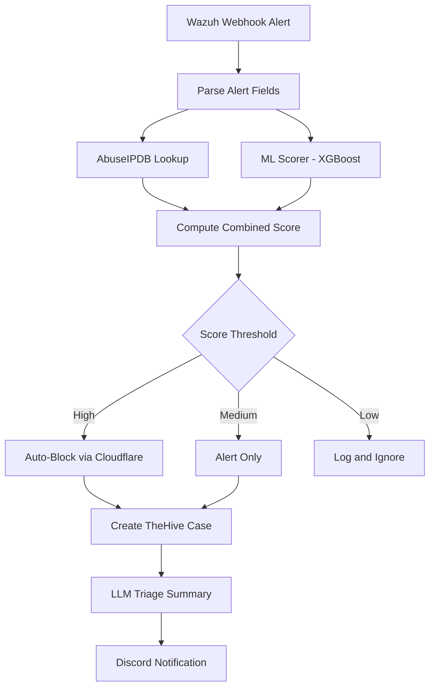

# Shuffle SOAR

Shuffle SOAR platform running on **brisket** (10.10.20.30) with 7 active automation workflows. The platform integrates with Wazuh, TheHive, Cortex, the ML Scorer, ELK, Caldera, and Ollama (qwen3:8b) to provide automated enrichment, triage, response, and intelligence reporting.

## Workflow Inventory

| ID | Workflow | Trigger | Schedule (EST) |
|----|----------|---------|----------------|
| WF1 | Threat Enrichment and Auto-Block | Wazuh webhook | On alert |
| WF2 | Watch Turnover Digest | System cron | 06:05 / 18:05 |
| WF3 | Detection Gap Analyzer | Webhook | On demand |
| WF5 | Daily Alert Cluster Triage | System cron | 06:00 |
| WF6 | Model Drift Detector | System cron | 09:00 |
| WF7 | Honeypot Intel Report | System cron | 12:00 Sun |
| WF8 | LLM Log Anomaly Finder | System cron | 15:00 |

WF4 (Velociraptor Triage) is planned but not yet implemented.

## WF1 -- Threat Enrichment and Auto-Block

The primary real-time response workflow. Receives Wazuh alerts via webhook, enriches them with external threat intelligence and ML scoring, then takes automated action based on a combined risk score.



**Scoring logic:** `max(abuseipdb_normalized, ml_xgboost_score)` -- the higher of the two signals drives the response action.

## Scheduling Architecture

Shuffle's on-premises scheduler is interval-based, not cron-based. The `frequency` field in schedule documents must be an integer (seconds); cron strings fail at parse time. To achieve precise time-anchored execution, all scheduled workflows use **system cron on brisket** that triggers the workflow via a curl POST to the Shuffle API.

Trigger scripts are located in [`trigger-scripts/`](trigger-scripts/) and are registered in brisket's crontab.

## Workflow Variable Convention

All credentials and service URLs are centralized as **workflow variables** (`$varname`). Shuffle substitutes `$varname` with the actual value before execution. This convention ensures:

- No hardcoded secrets in workflow JSON exports or `execute_python` code
- Credential rotation requires updating a single variable, not editing every action
- Exported workflows in this repository are safe to share (variables resolve at runtime)

## LLM Integration

Five workflows (WF1, WF2, WF6, WF7, WF8) use Ollama with the `qwen3:8b` model for natural language analysis. Key implementation details:

- Prompts are prefixed with `/no_think` to suppress qwen3's internal reasoning tokens
- `num_predict` is set to 1000+ to prevent thinking tokens from exhausting the budget
- `<think>` tags are stripped from responses with regex post-processing
- LLM output is sanitized (double quotes replaced, newlines escaped) before Discord delivery

Schedules are staggered at least 3 hours apart to avoid Ollama GPU contention.

## Directory Structure

```
shuffle/
  workflows/
    wf1-threat-enrichment.json
    wf2-watch-turnover.json
    wf3-detection-gaps.json
    wf5-daily-triage.json
    wf6-model-drift.json
    wf7-honeypot-intel.json
    wf8-log-anomaly.json
  trigger-scripts/
    wf2-trigger.sh
    wf5-trigger.sh
    wf6-trigger.sh
    wf7-trigger.sh
    wf8-trigger.sh
  docs/
    wf6-wf7-wf8-design.md    # Design document for the AI/ML workflow suite
```
